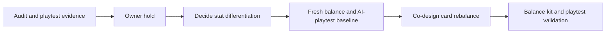

## prod_045_card_economy_rebalance_product_brief - Card Economy Rebalance Product Brief
> Date: 2026-07-21
> Status: Settled
> Related request: `req_081_rebalance_card_economy_to_remove_dead_cards_and_redundant_duplicates`
> Related backlog: `item_179_reprice_and_re_role_dead_and_duplicate_cards_with_balance_kit_validation`
> Related task: `task_082_orchestrate_card_economy_rebalance`
> Related architecture: (none yet)
> Reminder: Update status, linked refs, scope, decisions, success signals, and open questions when you edit this doc.
> Non-semantic edit: 2026-07-21 added hold diagram and clarified existing owner-blocked scope without starting implementation.
> Semantic edit: 2026-07-21 documented owner hold, stat-differentiation coupling, and unblock criteria.
> Confidence: 90

# Overview
Turn the 15-card catalogue into a set of real choices: kill dead cards, differentiate duplicates, and make paid cards worth more than free tuning, all validated by the balance kit and AI playtest rather than intuition.

# Goals
- Every card has an evidenced reason to be bought or played.
- No dominant cheap card and no dead expensive card.
- Paid cards are distinct from the free directive knobs.
- Changes are driven and proven by balance and playtest evidence.

# Non-goals
- Do not add new cards or a new card family in this request.
- Do not change the stat model or the core simulation formula (separate stat-differentiation request).
- Do not recommend cards or expose a best-card ranking.
- Do not break determinism or ship magnitude changes without updating the tests intentionally.

# Scope and guardrails
- In when unblocked: card price/effect changes for confirmed dead or duplicate cards, balance-kit validation, AI-playtest validation, and deterministic test updates.
- In before unblocked: preserve the evidence chain and the owner hold.
- Out while blocked: code changes to card effects, prices, simulation, copy, or tests.
- Out: adding new card families, recommending a best card, or tuning cards against the current flat stat model.

# Key product decisions
- Owner decision 2026-07-21: hold this request until stat differentiation direction is decided.
- Treat card economy and stat differentiation as one coupled depth pass; card tuning against the current flat stat model would be invalidated.
- Unblock only after `req_084_differentiate_circuit_stats_and_make_bot_configurations_react_to_circuit_identity` lands with a fresh AI-playtest baseline and a co-designed stat/card plan.

# Success signals
- When unblocked, every card is bought or played a non-trivial number of times in comparable AI playtest evidence.
- No card dominates points, win rate, and credit margin simultaneously.
- Paid cards create trade-offs that free directive knobs do not already provide.

# References
- Product back-reference: `item_179_reprice_and_re_role_dead_and_duplicate_cards_with_balance_kit_validation`
- Task back-reference: `task_082_orchestrate_card_economy_rebalance`
- Roadmap hold: `logics/roadmap/road_002_cr_league_roadmap_v2.md`
- Audit evidence: `docs/audits/AUDIT_CR_LEAGUE.md`
- Prerequisite request: `req_084_differentiate_circuit_stats_and_make_bot_configurations_react_to_circuit_identity`
