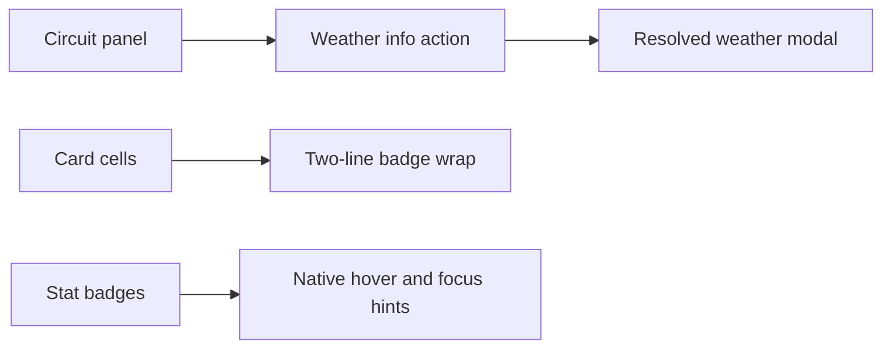

## prod_047_race_weather_and_card_stat_readability_product_brief - Race Weather And Card Stat Readability Product Brief
> Date: 2026-07-21
> Status: Proposed
> Related request: `req_083_move_real_weather_detail_into_a_circuit_info_modal_and_improve_card_stat_badge_readability`
> Related backlog: `item_181_move_resolved_weather_details_to_a_circuit_info_modal`, `item_182_wrap_card_stat_badges_and_add_stat_explanations`
> Related task: `task_084_orchestrate_weather_and_card_stat_readability`
> Related architecture: (none yet)
> Reminder: Update status, linked refs, scope, decisions, success signals, and open questions when you edit this doc.
> Confidence: 90

# Overview
Keep race information useful without clutter: move detailed resolved-weather explanation behind a circuit info action and make card stat badges readable and self-explanatory.

# Goals
- Make the circuit panel carry the weather detail at the moment it matters.
- Reduce replay progress text noise after a GP.
- Make card stat badges scan cleanly on compact card surfaces.
- Let players understand Grip, Attack, and Endurance from the badge itself.

# Non-goals
- Do not change weather generation or resolved race data.
- Do not change card effects, card prices, or simulation balance.
- Do not add a custom tooltip system unless native hover/focus text is insufficient.
- Do not redesign card layouts beyond badge wrapping and spacing.

# Scope and guardrails
- In: resolved-weather details moved behind a compact circuit info action and modal.
- In: card stat badge wrapping and native explanatory hover/focus text.
- Out: weather generation, simulation outcomes, card prices/effects, and broad layout redesign.

# Key product decisions
- Use the circuit panel as the entry point for resolved weather because it already owns city, layout, lap count, and forecast context.
- Keep replay progress markers visible but remove the long phase summary from the main control flow.
- Start badge explanations with native `title`/`aria-label` behavior, not a custom tooltip system.

# Success signals
- Replay controls feel less text-heavy after a GP.
- Players can inspect weather phases without losing the race context.
- Card stat badges remain readable in Plan, Inventory, Shop, and card detail surfaces.

# References
- Product back-reference: `req_083_move_real_weather_detail_into_a_circuit_info_modal_and_improve_card_stat_badge_readability`
- Task back-reference: `task_084_orchestrate_weather_and_card_stat_readability`
