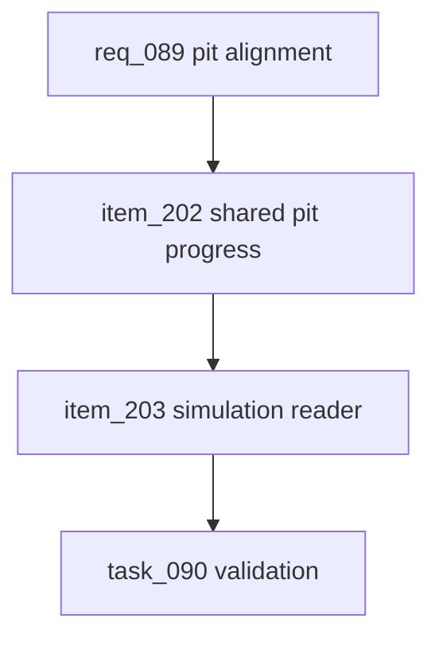

## prod_053_pit_stop_visual_alignment_product_brief - Pit-Stop Visual Alignment Product Brief
> Date: 2026-07-22
> Status: Settled
> Related request: `req_089_align_pit_stop_visual_position_stop_cars_where_the_pit_is_drawn_on_the_circuit_map`
> Related backlog: `item_202_expose_per_circuit_pit_lane_progress_as_shared_circuit_data`
> Related task: `task_090_orchestrate_pit_stop_visual_alignment`
> Related architecture: (none yet)
> Reminder: Update status, linked refs, scope, decisions, success signals, and open questions when you edit this doc.

# Overview
During-race pit stops render the car stopping at the wrong place because the simulation halts the car at a flat hardcoded half-lap position while the map draws the pit garage from circuit geometry — two unrelated values. This request derives each circuit's pit-lane progress from its geometry once, exposes it as shared circuit data, and feeds it into the simulation so cars stop exactly where the pit is drawn, on every circuit.

# Goals
- A pitting car visibly halts at the drawn pit garage, not an arbitrary half-lap point.
- The map and the simulation share one per-circuit pit-lane-progress source of truth.
- The stored value is generated from geometry and audited so it cannot drift from the route.

# Non-goals
- Do not change the longest-straight heuristic that chooses the pit placement.
- Do not move the full route geometry into the shared package; only the derived scalar is needed.
- Do not address the separate replay time-vs-distance dwell behavior.
- Do not retune pit-stop cost or timing.

# Scope and guardrails
- In: scaffolded request, product, backlog, orchestration task, validation, and handoff context.
- Out: unrelated workflow docs and implementation of generated tasks.

# Key product decisions
- Use structured input as the source of truth for generated docs.
- Keep generated write paths local and repo-bounded.

# Success signals
- Generated docs pass lint and audit without broad manual rewrites.
- Context-pack output can be handed to an implementation agent directly.

# References
- Product back-reference: `item_202_expose_per_circuit_pit_lane_progress_as_shared_circuit_data`
- Task back-reference: `task_090_orchestrate_pit_stop_visual_alignment`
