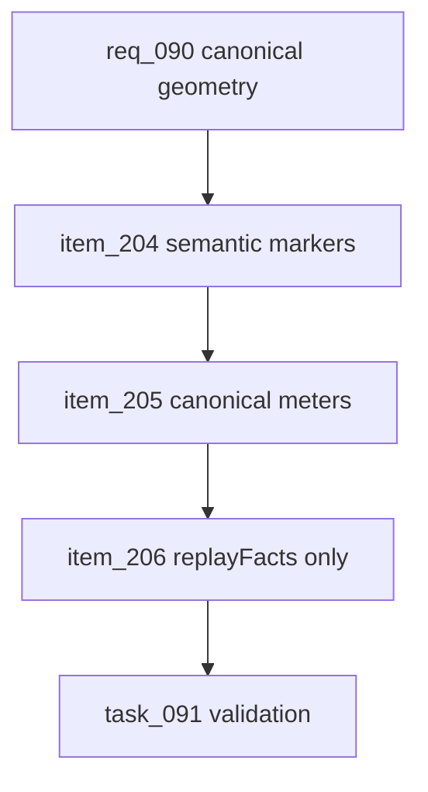

## prod_054_canonical_race_track_geometry_product_brief - Canonical Race-Track Geometry Product Brief
> Date: 2026-07-22
> Status: Settled
> Related request: `req_090_canonical_race_track_geometry_generate_semantic_track_markers_instead_of_interpreting_them_on_the_map`
> Related backlog: `item_204_generate_the_main_straight_and_start_line_as_canonical_track_data`
> Related task: `task_091_orchestrate_canonical_race_track_geometry`
> Related architecture: (none yet)
> Reminder: Update status, linked refs, scope, decisions, success signals, and open questions when you edit this doc.

# Overview
An architecture audit after the pit-stop alignment fix found the same smell across the whole map: the race track's semantic geometry (main straight, start/finish line, real length, race beats) is never stored as canonical data — the web improvises it from raw route points with magic numbers, and the simulation improvises separately. This request extends the single-canonical-origin principle from the pit to the whole track: generate the semantic markers once, store them as shared circuit data read by both sides, base replay pacing on real meters, and delete the client-side beat re-derivation that only exists to drift.

# Goals
- Every semantic track position (start line, pit, main straight) is generated once and read by both the simulation and the map.
- No race geometry is decided on the client or improvised at render time.
- Replay pacing derives from canonical meters, not projected pixels.
- There is exactly one source of race beats (the simulation's replayFacts); the client duplicates are gone.

# Non-goals
- Do not introduce real per-corner or per-sector geometry; the abstract 5-segment sim model stays.
- Do not change map projection, zoom, tiling, camera, or cosmetic drift/heading.
- Do not retune the placement heuristic values; only move them to one canonical origin.
- Do not redo the pit-position work owned by req_089.

# Scope and guardrails
- In: scaffolded request, product, backlog, orchestration task, validation, and handoff context.
- Out: unrelated workflow docs and implementation of generated tasks.

# Key product decisions
- Use structured input as the source of truth for generated docs.
- Keep generated write paths local and repo-bounded.

# Success signals
- Generated docs pass lint and audit without broad manual rewrites.
- Context-pack output can be handed to an implementation agent directly.

# References
- Product back-reference: `item_204_generate_the_main_straight_and_start_line_as_canonical_track_data`
- Task back-reference: `task_091_orchestrate_canonical_race_track_geometry`
