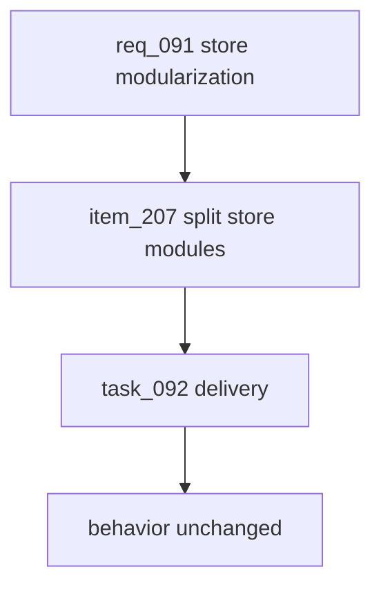

## prod_055_leagues_store_modularization_product_brief - Leagues Store Modularization Product Brief
> Date: 2026-07-22
> Status: Proposed
> Related request: `req_091_modularize_the_oversized_leagues_store`
> Related backlog: `item_207_split_leagues_store_into_lifecycle_modules_behind_a_barrel`
> Related task: `task_092_orchestrate_leagues_store_modularization`
> Related architecture: (none yet)
> Reminder: Update status, linked refs, scope, decisions, success signals, and open questions when you edit this doc.
> Non-semantic edit: Added overview Mermaid diagram to satisfy companion-doc hygiene; no scope/status change.

# Overview
Reorganize CR League's oversized leagues store into cohesive lifecycle modules behind an unchanged barrel export, improving maintainability without touching behavior or the public API.

# Goals
- Reduce store.ts from a 1197-line catch-all to a thin barrel over focused modules.
- Give each lifecycle (profiles, leagues, cards, decisions, qualifying, resolution, reads) its own file.
- Centralize the shared transaction helpers so race-integrity logic lives in one place.
- Keep the change provably behavior-neutral via the existing test suite.

# Non-goals
- Do not change any function behavior, transaction boundary, lock, or rule-error message.
- Do not alter the public import surface consumed by routes.ts, admin/store.ts, or tests.
- Do not add dependencies or introduce a new architectural pattern beyond plain module files.
- Do not refactor the simulation engine, Prisma schema, or API routes.

# Scope and guardrails
- In: module extraction inside `apps/api/src/features/leagues`, a `store.ts` barrel with unchanged named exports, shared transaction helpers in one place, and validation proving behavior stays identical.
- Out: API route changes, admin consumer changes, Prisma schema changes, rule-message rewrites, simulation changes, or new dependencies.

# Key product decisions
- Treat this as maintainability work, not a behavior pass: preserve row-lock order, transaction boundaries, and public import paths exactly.
- Use plain TypeScript modules and the existing barrel-export pattern; do not introduce a service/container abstraction for this split.

# Success signals
- `store.ts` is reduced to a thin re-export surface while lifecycle modules own their local helpers.
- Existing API/admin/tests import from the same module path with no consumer churn.
- `npm run typecheck`, `npm run lint`, the unit suite, and Logics validation pass after the move.

# References
- Product back-reference: `req_091_modularize_the_oversized_leagues_store`
- Task back-reference: `task_092_orchestrate_leagues_store_modularization`
