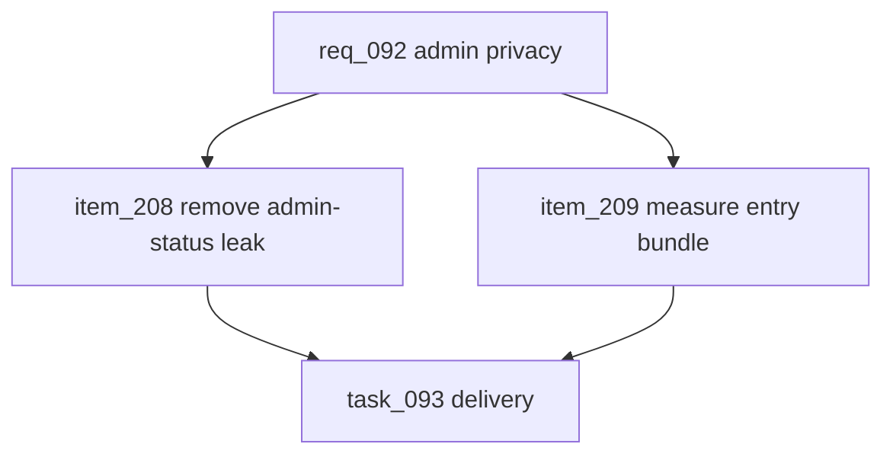

## prod_056_admin_privacy_and_entry_payload_hardening_product_brief - Admin Privacy and Entry Payload Hardening Product Brief
> Date: 2026-07-22
> Status: Proposed
> Related request: `req_092_admin_status_privacy_and_entry_bundle_hardening`
> Related backlog: `item_208_remove_public_admin_eligibility_lookup`, `item_209_measure_and_reduce_the_main_entry_bundle_warning`
> Related task: `task_093_orchestrate_admin_privacy_and_entry_payload_hardening`
> Related architecture: (none yet)
> Reminder: Update status, linked refs, scope, decisions, success signals, and open questions when you edit this doc.
> Non-semantic edit: Added overview Mermaid diagram to satisfy companion-doc hygiene; no scope/status change.

# Overview
A focused hardening pass that closes the public admin eligibility leak and turns the remaining production build chunk warning into measured frontend payload work. The fix should stay small: admin status comes only from proven profile create/recover responses, and route-heavy circuit data is deferred only where measurement shows it is causing the entry bundle warning.

# Goals
- Stop revealing admin eligibility from a bare profile id.
- Preserve the existing admin UX for legitimately recovered admin profiles.
- Reduce or explain the main entry chunk warning with measured evidence.
- Avoid new auth infrastructure until there is a broader session requirement.
- Leave a clean validation trail for another implementation agent.

# Non-goals
- Do not implement full server-side login sessions or token refresh.
- Do not change the admin token mechanism.
- Do not rewrite the circuit map, replay engine, or route generation tools.
- Do not hide the Vite warning by only raising chunkSizeWarningLimit.
- Do not touch unrelated Logics tasks such as leagues-store modularization.

# Scope and guardrails
- In: scaffolded request, product, backlog, orchestration task, validation, and handoff context.
- Out: unrelated workflow docs and implementation of generated tasks.

# Key product decisions
- Use structured input as the source of truth for generated docs.
- Keep generated write paths local and repo-bounded.

# Success signals
- Generated docs pass lint and audit without broad manual rewrites.
- Context-pack output can be handed to an implementation agent directly.

# References
- Product back-reference: `req_092_admin_status_privacy_and_entry_bundle_hardening`
- Task back-reference: `task_093_orchestrate_admin_privacy_and_entry_payload_hardening`
