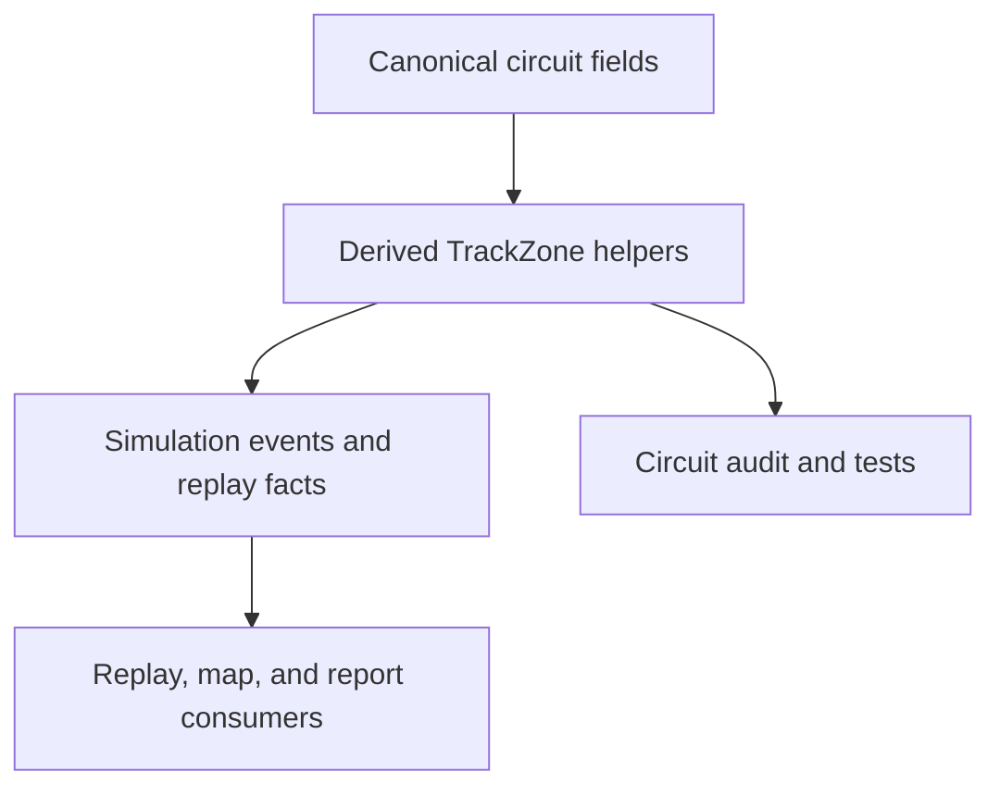

## prod_057_canonical_track_zones_product_brief - Canonical Track Zones Product Brief
> Date: 2026-07-22
> Status: Proposed
> Related request: `req_093_canonical_track_zones_for_spatial_race_simulation`
> Related backlog: `item_210_add_canonical_track_zone_model_and_derived_circuit_zones`, `item_211_annotate_simulation_events_and_replay_facts_with_track_zones`, `item_212_consume_canonical_track_zones_in_replay_map_and_reports`, `item_213_document_deferred_zone_driven_gameplay_tuning`
> Related task: `task_094_orchestrate_canonical_track_zones_for_spatial_race_simulation`
> Related architecture: (none yet)
> Reminder: Update status, linked refs, scope, decisions, success signals, and open questions when you edit this doc.

# Overview
CR League now has canonical circuit geometry for start, pit, length, and straight-line facts, but the race simulation still treats the track mostly as five abstract phases while the map/replay layer knows visual positions. This feature adds a compact shared track-zone contract so sectors, overtaking windows, pit entry/exit, and local technical areas are represented once and consumed by the simulation, replay, and reports without moving map projection or camera logic into the domain.

# Goals
- Give every circuit a canonical set of race-relevant zones that simulation and replay can share.
- Map the existing five race segments to real progress ranges on the circuit.
- Represent pit entry/exit and overtaking windows from existing canonical marker fields.
- Allow simulation events and replay facts to identify where on the track something happened.
- Keep the first slice data-driven and deterministic, with no gameplay retune.

# Non-goals
- Do not build a physics engine, racing-line solver, collision model, or corner-by-corner track database.
- Do not move projection, camera, route fitting, tile rendering, marker pose, sprite drift, or CSS concerns into shared code.
- Do not rebalance cards, scoring, rewards, bot strategy, or league cadence.
- Do not require manual full-track annotation for every circuit in v1.
- Do not change persisted race results unless optional fields are backward-compatible.

# Scope and guardrails
- In: shared `TrackZone` types/helpers, derived zone defaults for all circuits, zone metadata on existing simulation events/replay facts, replay/map/report consumption of canonical zone facts, focused tests, and circuit audit coverage.
- Out: map projection, camera, route fitting, marker transforms, full physics, per-corner databases, gameplay balance, card retuning, rewards, bot strategy, and league cadence.

# Key product decisions
- Track zones are race semantics, so they live in shared domain code and remain independent from web-only visual route projection.
- V1 derives useful defaults from existing canonical circuit fields before adding hand-authored per-circuit data.
- Zone metadata is optional/backward-compatible on race outputs and must not change scoring or deterministic outcomes.
- Zone-driven gameplay tuning is deliberately deferred until the data contract has landed and can be tested independently.

# Workflow

# Success signals
- Every current circuit exposes validated sector, overtake, technical, and pit zone coverage.
- Simulation events and replay facts identify canonical progress and zone context for representative pit, overtake, weather, traffic, and segment moments.
- Replay, map, and report code consumes zone facts without moving visual-only rendering concerns into shared code.
- The requested validation gate passes and the closeout records exact command proof.

# References
- Product back-reference: `req_093_canonical_track_zones_for_spatial_race_simulation`
- Task back-reference: `task_094_orchestrate_canonical_track_zones_for_spatial_race_simulation`
