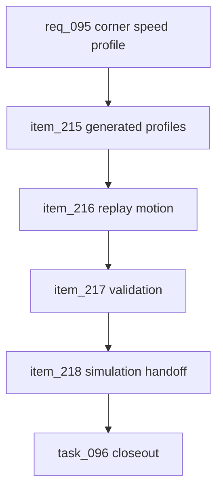

## prod_058_canonical_corner_speed_profile_product_brief - Canonical Corner Speed Profile Product Brief
> Date: 2026-07-23
> Status: Settled
> Related request: `req_095_canonical_corner_speed_profile_for_replay_motion`
> Related backlog: `item_215_generate_canonical_speed_profiles_from_circuit_route_curvature`
> Related task: `task_096_orchestrate_canonical_corner_speed_profile_for_replay_motion`
> Related architecture: (none yet)
> Reminder: Update status, linked refs, scope, decisions, success signals, and open questions when you edit this doc.
> Confidence: 90
> Understanding: 90
> Theme: Replay fidelity
> Complexity: Medium

# Overview
CR League now has canonical route length, start, pit, main-straight, and zone data, but replay cars still move with mostly uniform progress along the track. This makes distance-faithful replays feel slow without giving the viewer the natural rhythm of braking, cornering, and exit acceleration. This feature generates a compact speed profile from circuit curvature and straights, stores it as canonical circuit data, and uses it in replay motion first while preserving simulation outcomes.

# Goals
- Make replay motion feel more like cars driving a circuit, with visible braking before corners and recovery after them.
- Keep the speed model canonical and generated from route geometry, not hand-authored per circuit or recalculated every frame.
- Preserve replay determinism and alignment with events, pit stops, overtakes, and tower data.
- Finish a complete replay-visible feature and define the gate for future simulation use.

# Non-goals
- Do not build a physics engine, racing-line solver, tire model, collision model, or per-driver steering model.
- Do not change classification, simulation elapsed times, rewards, card effects, bot strategy, or economy balance in this request.
- Do not hand-author full corner annotations for every circuit.
- Do not introduce new runtime dependencies for geometry analysis.
- Do not use speed-profile data for simulation until the replay-only pass has explicit acceptance proof.

# Scope and guardrails
- In: shared speed-profile contract, generated per-circuit profiles, replay-only visual progress mapping, circuit audit coverage, focused unit tests, and simulation handoff documentation.
- Out: race outcome changes, balance changes, per-driver physics, new UI controls, or runtime geometry analysis inside animation frames.

# Key product decisions
- Store speed profiles as canonical shared circuit data keyed by `layoutKey`; generate them from route curvature and main straight metadata.
- Use `braking`, `corner`, `exit`, and `straight` spans with bounded speed factors. Replay integrates these spans over a normalized lap so every lap still starts and ends at canonical progress.
- Apply profiles to replay car positions only. Trace times, pit events, director beats, tower gaps, simulation results, rewards, cards, and classification remain canonical.
- Future simulation use needs a separate request after replay validation, audit stability, and balance-baseline proof.

# Success signals
- Every current circuit exposes a generated, bounded profile and `npm run audit:circuits` reports speed-profile health.
- Replay tests prove the profile changes visual progress, preserves endpoints, and keeps pit-stop trace positions aligned.
- Full closeout records typecheck, lint, tests, build, circuit audit, and Logics validation.

# References
- Product back-reference: `item_215_generate_canonical_speed_profiles_from_circuit_route_curvature`
- Task back-reference: `task_096_orchestrate_canonical_corner_speed_profile_for_replay_motion`
