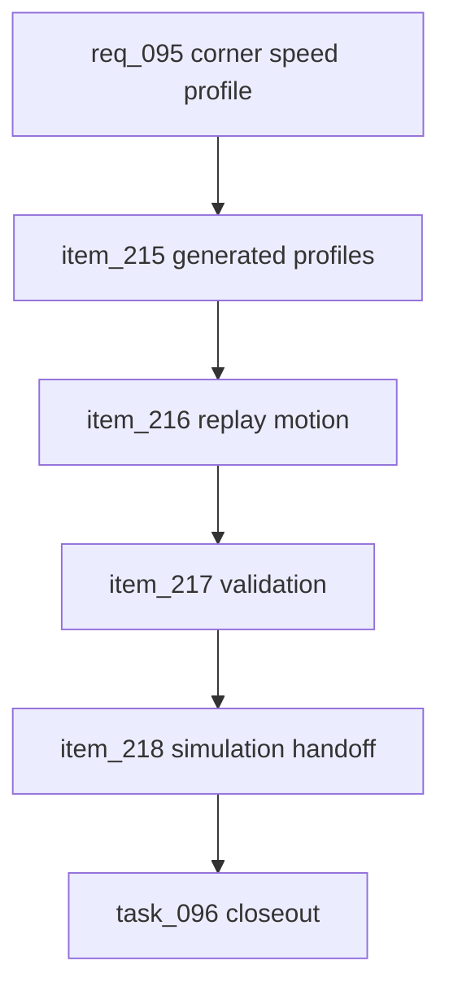

## prod_058_canonical_corner_speed_profile_product_brief - Canonical Corner Speed Profile Product Brief
> Date: 2026-07-23
> Status: Proposed
> Related request: `req_095_canonical_corner_speed_profile_for_replay_motion`
> Related backlog: `item_215_generate_canonical_speed_profiles_from_circuit_route_curvature`, `item_216_apply_speed_profiles_to_replay_motion_without_changing_race_outcomes`, `item_217_validate_replay_speed_profiles_across_representative_circuits`, `item_218_document_the_simulation_handoff_for_speed_profile_gameplay`
> Related task: `task_096_orchestrate_canonical_corner_speed_profile_for_replay_motion`
> Related architecture: (none yet)
> Reminder: Update status, linked refs, scope, decisions, success signals, and open questions when you edit this doc.

# Overview
CR League now has canonical route length, start, pit, main-straight, and zone data, but replay cars still move with mostly uniform progress along the track. This makes distance-faithful replays feel slow without giving the viewer the natural rhythm of braking, cornering, and exit acceleration. This feature generates a compact speed profile from circuit curvature and straights, stores it as canonical circuit data, and uses it in replay motion first while preserving simulation outcomes.

# Goals
- Make replay motion feel more like cars driving a circuit, with visible braking before corners and recovery after them.
- Keep the speed model canonical and generated from route geometry, not hand-authored per circuit or recalculated every frame.
- Preserve replay determinism and alignment with events, pit stops, overtakes, and tower data.
- Finish a complete replay-visible feature and define the gate for future simulation use.

# Non-goals
- Do not build a physics engine, racing-line solver, tire model, collision model, or per-driver steering model.
- Do not change classification, simulation elapsed times, rewards, card effects, bot strategy, or economy balance in this request.
- Do not hand-author full corner annotations for every circuit.
- Do not introduce new runtime dependencies for geometry analysis.
- Do not use speed-profile data for simulation until the replay-only pass has explicit acceptance proof.

# Scope and guardrails
- In: scaffolded request, product, backlog, orchestration task, validation, and handoff context.
- Out: unrelated workflow docs and implementation of generated tasks.

# Key product decisions
- Use structured input as the source of truth for generated docs.
- Keep generated write paths local and repo-bounded.

# Success signals
- Generated docs pass lint and audit without broad manual rewrites.
- Context-pack output can be handed to an implementation agent directly.

# References
- Product back-reference: `req_095_canonical_corner_speed_profile_for_replay_motion`
- Task back-reference: `task_096_orchestrate_canonical_corner_speed_profile_for_replay_motion`
