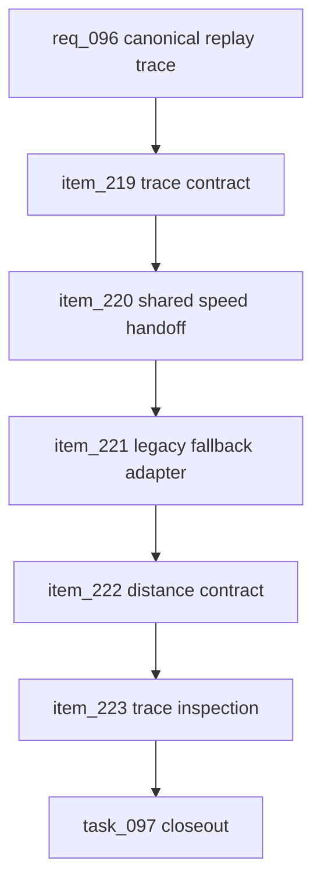

## prod_059_canonical_race_track_replay_trace_product_brief - Canonical Race-Track Replay Trace Product Brief
> Date: 2026-07-23
> Status: Settled
> Related request: `req_096_canonical_race_track_replay_trace_and_simulation_handoff`
> Related backlog: `item_219_define_the_canonical_replay_trace_contract_for_generated_races`
> Related task: `task_097_orchestrate_canonical_race_track_replay_trace_and_simulation_handoff`
> Related architecture: (none yet)
> Reminder: Update status, linked refs, scope, decisions, success signals, and open questions when you edit this doc.

# Overview
CR League's race-track replay is now visually stronger, but the architecture still has two competing layers: the simulation emits more canonical race facts, while the web replay can still reconstruct or remap race meaning locally. This feature makes the generated replay trace the handoff contract between simulation and rendering. The simulation/shared layer owns car progress, speed phase, zone context, event progress, and live ordering for new races; the web layer renders those facts and keeps a small legacy adapter only for old persisted results.

# Goals
- Make replay map, tower, event markers, and director markers agree because they consume the same canonical race trace.
- Represent braking, cornering, exits, straights, pit movement, and overtake context at the shared trace boundary.
- Remove or isolate duplicated replay fallbacks that can drift from simulation facts.
- Clarify distance semantics so simulation distance, route distance, replay pacing, and UI labels are auditable.
- Give developers an inspection path for race-track trace health before using zones and speed profiles for gameplay balance.

# Non-goals
- Do not build a physics engine, collision model, tire model, racing-line solver, or per-driver steering model.
- Do not rebalance race outcomes, rewards, cards, bot strategy, or economy in this request.
- Do not remove compatibility for already-persisted legacy results that lack complete replay traces.
- Do not move map projection, camera, tile rendering, SVG placement, CSS, or animation-frame details into shared simulation code.
- Do not add user-facing replay controls or explanatory UI unless needed to consume existing canonical facts.

# Scope and guardrails
- In: scaffolded request, product, backlog, orchestration task, validation, and handoff context.
- Out: unrelated workflow docs and implementation of generated tasks.

# Key product decisions
- Use structured input as the source of truth for generated docs.
- Keep generated write paths local and repo-bounded.

# Success signals
- Generated docs pass lint and audit without broad manual rewrites.
- Context-pack output can be handed to an implementation agent directly.

# References
- Product back-reference: `item_219_define_the_canonical_replay_trace_contract_for_generated_races`
- Task back-reference: `task_097_orchestrate_canonical_race_track_replay_trace_and_simulation_handoff`
