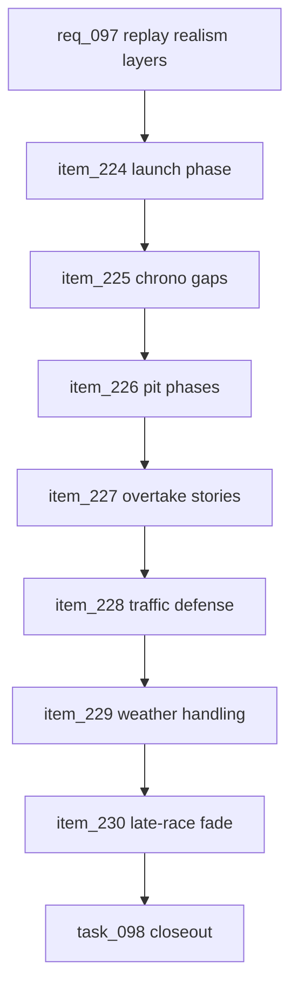

## prod_060_race_replay_realism_layers_product_brief - Race Replay Realism Layers Product Brief
> Date: 2026-07-23
> Status: Settled
> Related request: `req_097_race_replay_realism_layers_after_canonical_trace`
> Related backlog: `item_224_add_launch_and_first_corner_replay_phase`
> Related task: `task_098_orchestrate_race_replay_realism_layers_after_canonical_trace`
> Related architecture: (none yet)
> Reminder: Update status, linked refs, scope, decisions, success signals, and open questions when you edit this doc.

# Overview
CR League should make race replays feel more like a race without becoming a physics project. Once the canonical replay trace is the handoff between simulation and rendering, the next gains are small deterministic realism layers: better starts, chrono-gap spacing, pit-lane phases, prepared overtakes, traffic/defense, weather-visible handling, and late-race pace fade. Each layer must explain existing race facts more clearly, not invent a second race in the browser.

# Goals
- Make starts, battles, pit stops, weather, and late-race behavior more legible in replay.
- Keep every realism layer deterministic and trace-level.
- Preserve alignment between map position, tower order, event markers, director beats, and final classification.
- Ship the work in small slices with clear validation per layer.
- Avoid a broad physics engine or gameplay balance retune.

# Non-goals
- Do not build tire simulation, collision handling, racing-line selection, steering physics, or continuous vehicle dynamics.
- Do not change rewards, economy, card effects, bot strategy, or league cadence.
- Do not create overtakes, pit moments, weather incidents, or fatigue losses in the renderer.
- Do not add new replay controls or explanatory user-facing UI unless a specific slice requires it.
- Do not optimize every legacy persisted result; keep legacy compatibility in the fallback adapter from the canonical trace work.

# Scope and guardrails
- In: scaffolded request, product, backlog, orchestration task, validation, and handoff context.
- Out: unrelated workflow docs and implementation of generated tasks.

# Key product decisions
- Use structured input as the source of truth for generated docs.
- Keep generated write paths local and repo-bounded.

# Success signals
- Generated docs pass lint and audit without broad manual rewrites.
- Context-pack output can be handed to an implementation agent directly.

# References
- Product back-reference: `item_224_add_launch_and_first_corner_replay_phase`
- Task back-reference: `task_098_orchestrate_race_replay_realism_layers_after_canonical_trace`
