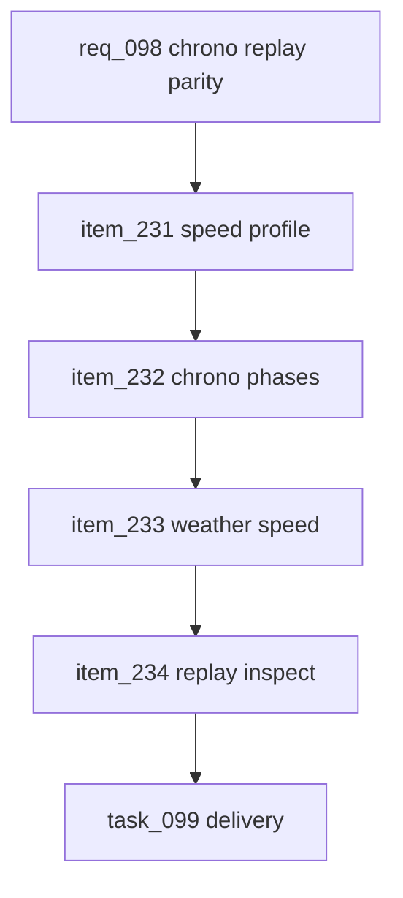

## prod_061_chrono_replay_race_track_parity_product_brief - Chrono Replay Race-Track Parity Product Brief
> Date: 2026-07-23
> Status: Proposed
> Related request: `req_098_chrono_replay_race_track_parity`
> Related backlog: `item_231_apply_circuit_speed_profile_to_chrono_replay_traces`, `item_232_add_chrono_compatible_replay_phases`, `item_233_make_chrono_weather_handling_visible_in_trace_speed`, `item_234_extend_replay_inspection_to_chrono_traces`
> Related task: `task_099_orchestrate_chrono_replay_race_track_parity`
> Related architecture: (none yet)
> Reminder: Update status, linked refs, scope, decisions, success signals, and open questions when you edit this doc.

# Overview
Chrono replays should feel like they are running on the same race track as Grand Prix replays, but only for concepts that make sense in a solo run. The goal is to reuse the canonical trace handoff for circuit speed profile, launch phase, weather-visible handling, and inspection proof while leaving race-only layers out of scope.

# Goals
- Make chrono replay motion respect circuit corners and straights.
- Expose simple chrono phases that match the race replay vocabulary where appropriate.
- Keep qualifying times and outcomes stable while improving replay readability.
- Give developers one inspection command that can compare race and chrono traces on representative circuits.
- Avoid fake race behavior in solo chronos.

# Non-goals
- Do not add pit stops, overtakes, traffic, defense, or multi-car gap spacing to solo chrono replays.
- Do not change qualifying lap-time formulas, grid sorting, card effects, bot choices, rewards, or economy.
- Do not build a new physics engine or duplicate `simulateRace` for chronos.
- Do not add new user-facing replay controls or explanatory UI copy.
- Do not optimize legacy persisted chrono traces beyond existing replay fallback compatibility.

# Scope and guardrails
- In: scaffolded request, product, backlog, orchestration task, validation, and handoff context.
- Out: unrelated workflow docs and implementation of generated tasks.

# Key product decisions
- Use structured input as the source of truth for generated docs.
- Keep generated write paths local and repo-bounded.

# Success signals
- Generated docs pass lint and audit without broad manual rewrites.
- Context-pack output can be handed to an implementation agent directly.

# References
- Product back-reference: `req_098_chrono_replay_race_track_parity`
- Task back-reference: `task_099_orchestrate_chrono_replay_race_track_parity`
