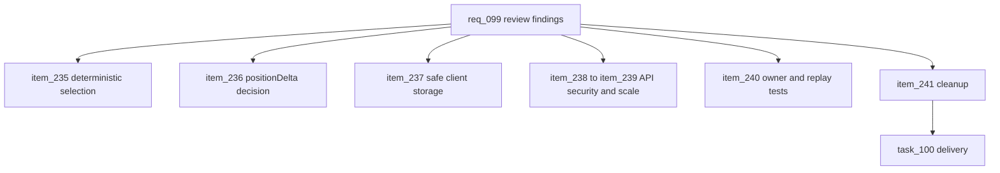

## prod_062_review_findings_remediation_product_brief - Review-Findings Remediation Product Brief
> Date: 2026-07-23
> Status: Settled
> Related request: `req_099_review_findings_remediation_replay_determinism_dead_card_effects_client_storage_safety_api_security_and_scale_admin_config_integrity_and_over_engineering_cleanup`
> Related backlog: `item_235_restore_deterministic_weighted_selection_and_pin_it_with_a_test`
> Related task: `task_100_orchestrate_review_findings_remediation`
> Related architecture: (none yet)
> Reminder: Update status, linked refs, scope, decisions, success signals, and open questions when you edit this doc.
> Non-semantic edit: 2026-07-23 corpus grooming note added; no status change.
> Semantic edit: 2026-07-23 added overview Mermaid diagram and replaced scaffold-generic scope/success text with implementation-specific framing.

# Overview
A full repo review of cr-league (release 0.4.1) found no critical fires but a ranked set of real issues: a replay-breaking determinism bug in weighted random selection, a dead card-effect accumulator that silently voids position-gain cards, unguarded client storage that can white-screen the app, two unauthenticated-surface security gaps (email header injection and account enumeration), missing rate limiting and unbounded admin reads, an owner-team removal that can permanently lock admin controls, a gap in replay-validation test coverage, and several over-engineering cleanups. This request remediates them in one pass, prioritizing the determinism and gameplay correctness issues first, and is authored to be executed end-to-end by another AI agent.

# Goals
- Deterministic replay is restored and protected by a regression test.
- Card position-gain effects are honest — either real in the standings or removed — with the decision recorded.
- The web client tolerates disabled or full browser storage without crashing.
- The unauthenticated API surface no longer leaks account existence, is not an email-header-injection vector, and cannot be trivially abused to exhaust the database.
- Admin controls stay reachable after owner-team removal, and the replay validator has negative test coverage.
- The simulation core, API utils, and App shell carry less accidental complexity.

# Non-goals
- Do not swap the PRNG algorithm or change the seeding model.
- Do not add session auth, CSRF, or replace the claim-code model.
- Do not introduce a distributed/Redis rate-limit store or any dependency beyond @fastify/rate-limit.
- Do not migrate JSON columns to relational tables or run destructive schema migrations.
- Do not unify the score-based classification with time-based replay movement in this pass (tracked as a follow-up).

# Scope and guardrails
- In: deterministic weighted selection, the `positionDelta` gameplay decision, crash-safe web storage access, unauthenticated API hardening, bounded admin reads, owner-team resilience, replay-validator negative tests, and the listed cleanup.
- Out: PRNG replacement, session auth/CSRF, distributed rate limiting, JSON-table migrations, broad accessibility work, and the larger score-vs-time replay model unification.

# Key product decisions
- Fix determinism and gameplay honesty before lower-risk cleanup so tests protect later refactors.
- Keep rate limiting in-process for the current single-instance deployment; use a shared store only if deployment topology changes.
- Record the `positionDelta` decision in the orchestration task before closeout because it changes whether the advertised card effect is implemented or removed.

# Success signals
- Weighted weather selection is key-order independent and pinned by tests.
- Storage/security/admin-scale fixes are covered by focused regression tests or integration assertions.
- The replay-trace cleanup reduces simulation-core coupling without changing replay behavior.
- `npm run typecheck`, `npm test`, `npm run build`, `npm run lint`, and `npm run logics:validate` pass.

# References
- Product back-reference: `item_235_restore_deterministic_weighted_selection_and_pin_it_with_a_test`
- Task back-reference: `task_100_orchestrate_review_findings_remediation`
