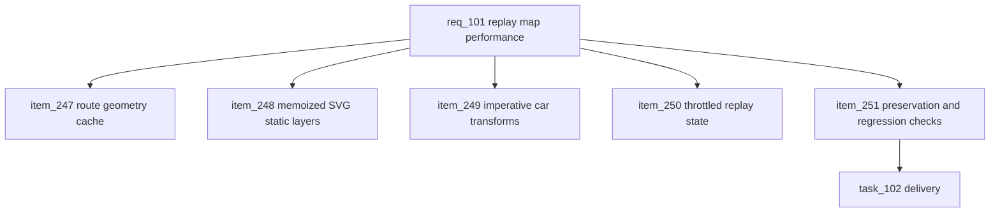

## prod_064_replay_map_render_performance_product_brief - Replay Map Render Performance Product Brief
> Date: 2026-07-23
> Status: Settled
> Related request: `req_101_replay_map_render_performance_memoize_route_geometry_hoist_static_svg_layers_imperative_car_transforms_and_throttle_non_positional_state`
> Related backlog: `item_247_memoize_immutable_route_geometry`
> Related task: `task_102_orchestrate_replay_map_render_performance`
> Related architecture: (none yet)
> Reminder: Update status, linked refs, scope, decisions, success signals, and open questions when you edit this doc.
> Semantic edit: 2026-07-23 added overview Mermaid diagram for closeout audit coverage.

# Overview
After the replay and race-track work landed, the replay map rendering became laggy. Investigation traced the cost entirely to the render path, not the simulation: route segment geometry is rebuilt ~9 times per car per frame from an immutable points array, and the full SVG subtree (tiles + heavy route paths + car sprites) re-renders 60 times a second because playback drives car positions through React state. This request removes the redundant geometry work, keeps the static layers out of the per-frame render, moves car positioning to imperative transforms like the existing camera loop, and throttles non-positional state - all while keeping replay output byte-identical and leaving circuit generation and the simulation untouched.

# Goals
- Replay playback is smooth on large circuits without changing what is rendered.
- Immutable route geometry is computed once, not thousands of times per second.
- Only car positions update per frame; static map layers do not re-render.
- Non-positional UI state refreshes at a sane cadence.
- The change is provably behavior-preserving and guarded against regression.

# Non-goals
- Do not change circuit generation (circuitScene, analyzeCircuitRoute, speed profiles).
- Do not change simulateRace or the replay trace output.
- Do not redesign the map or car visuals, or reduce tile/point resolution.
- Do not switch the renderer to canvas/WebGL.
- Do not add a new dependency.

# Scope and guardrails
- In: scaffolded request, product, backlog, orchestration task, validation, and handoff context.
- Out: unrelated workflow docs and implementation of generated tasks.

# Key product decisions
- Use structured input as the source of truth for generated docs.
- Keep generated write paths local and repo-bounded.

# Success signals
- Generated docs pass lint and audit without broad manual rewrites.
- Context-pack output can be handed to an implementation agent directly.

# References
- Product back-reference: `item_247_memoize_immutable_route_geometry`
- Task back-reference: `task_102_orchestrate_replay_map_render_performance`
