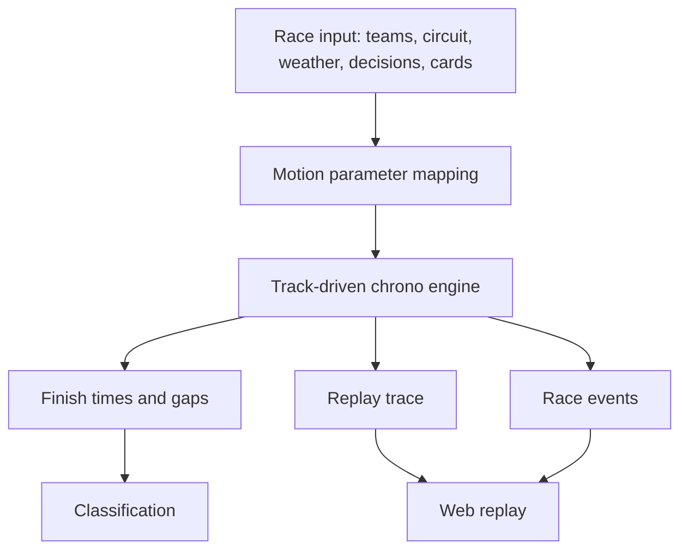

## prod_065_track_driven_chrono_race_engine_product_brief - Track-Driven Chrono Race Engine Product Brief
> Date: 2026-07-23
> Status: Proposed
> Related request: `req_102_track_driven_chrono_race_engine_derive_grand_prix_timing_gaps_classification_and_replay_from_speed_over_the_race_track`
> Related backlog: `item_252_define_the_chrono_engine_contract_and_motion_parameter_mapping`, `item_253_implement_deterministic_track_driven_time_distance_simulation`, `item_254_integrate_pit_stops_overtakes_defense_and_events_into_chrono_motion`, `item_255_make_replay_trace_and_web_replay_consume_chrono_truth`, `item_256_calibrate_balance_and_preserve_gameplay_value_across_the_new_engine`, `item_257_migration_gates_tests_and_rollout_readiness_for_chrono_engine`
> Related task: `task_103_orchestrate_track_driven_chrono_race_engine_migration`
> Related architecture: (none yet)
> Reminder: Update status, linked refs, scope, decisions, success signals, and open questions when you edit this doc.
> Non-semantic edit: 2026-07-23 added the required overview Mermaid diagram after scaffold generation.

# Overview
CR League currently decides races through abstract segment scores and then reconstructs a plausible replay trace. That is fast and controllable, but it creates a split truth: chronos and replay movement are not the same system. This product change moves Grand Prix simulation to an arcade track-driven chrono engine where each car's speed over circuit zones produces distance, finish time, gaps, classification, events, and replay trace. The goal is more credible racing and less brutal speed/chrono behavior without building a full physics simulator.

# Goals
- Make the race and replay share one chrono/motion truth.
- Give circuits real gameplay personality through their speed profiles and zones.
- Make decisions and cards affect understandable driving parameters instead of only abstract scores.
- Keep deterministic, arcade, testable simulation rather than full physics.
- Ship the migration with balance evidence and strong invariants before live usage.

# Non-goals
- Do not build a full physics/collision engine.
- Do not add dependencies, WebGL/canvas rendering, or UI redesign work.
- Do not rewrite the circuit catalogue or generation scripts as part of this request.
- Do not change API auth, storage, database schema, release automation, or admin tooling.
- Do not preserve exact historical winners for every seed; preserve contracts, determinism, and acceptable balance distributions.

# Scope and guardrails
- In: scaffolded request, product, backlog, orchestration task, validation, and handoff context.
- Out: unrelated workflow docs and implementation of generated tasks.

# Key product decisions
- Use structured input as the source of truth for generated docs.
- Keep generated write paths local and repo-bounded.

# Success signals
- Generated docs pass lint and audit without broad manual rewrites.
- Context-pack output can be handed to an implementation agent directly.

# References
- Product back-reference: `req_102_track_driven_chrono_race_engine_derive_grand_prix_timing_gaps_classification_and_replay_from_speed_over_the_race_track`
- Task back-reference: `task_103_orchestrate_track_driven_chrono_race_engine_migration`
