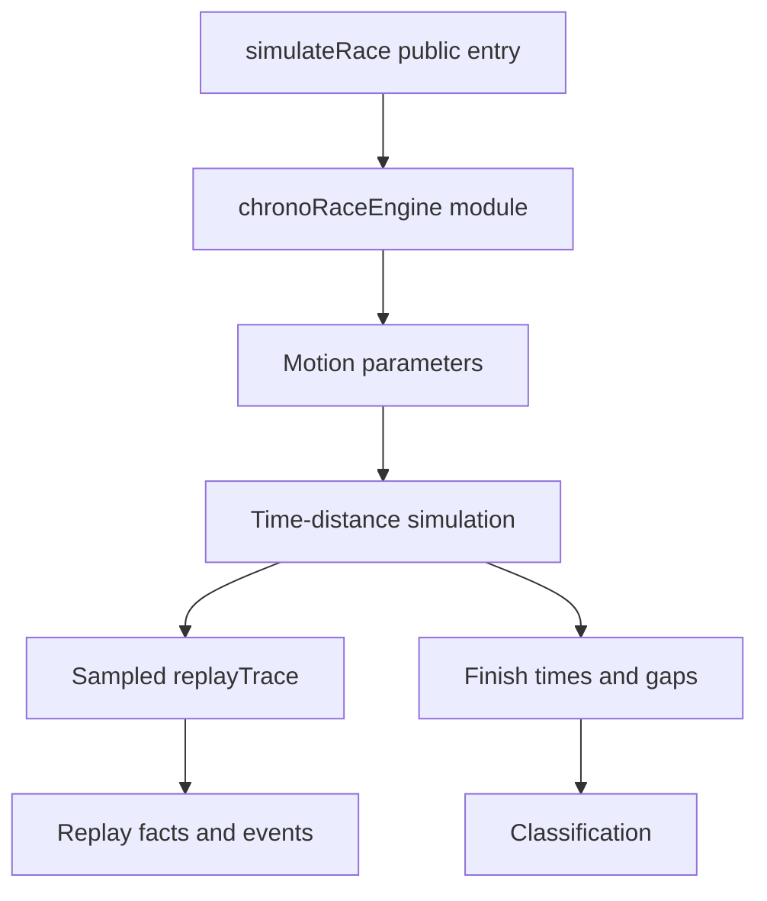

## prod_066_chrono_engine_v2_product_brief - Chrono Engine V2 Product Brief
> Date: 2026-07-23
> Status: Proposed
> Related request: `req_103_chrono_engine_v2_extract_the_race_engine_module_and_make_replay_trace_a_minimal_time_distance_simulation`
> Related backlog: `item_258_extract_the_chrono_race_engine_module_and_contract`, `item_259_capture_replaytrace_from_deterministic_time_distance_motion_state`, `item_260_align_pits_overtakes_defense_and_replay_facts_with_chrono_trace_state`, `item_261_harden_validation_balance_reporting_and_rollout_notes_for_chrono_v2`
> Related task: `task_104_orchestrate_chrono_engine_v2_module_extraction_and_trace_capture`
> Related architecture: (none yet)
> Reminder: Update status, linked refs, scope, decisions, success signals, and open questions when you edit this doc.
> Non-semantic edit: 2026-07-23 added the required overview Mermaid diagram after scaffold generation.

# Overview
The first chrono migration made GP results depend on deterministic finish times, but the replay trace is still mostly reconstructed from those times. Chrono Engine V2 makes the implementation easier to evolve by extracting the race engine into a focused internal module and by sampling replayTrace from a minimal deterministic time-distance simulation. The aim is a stronger single source of truth for timing, movement, pits, overtakes, gaps, and replay facts without building a full physics engine.

# Goals
- Make the chrono simulation readable, isolated, and testable outside the large simulateRace.ts file.
- Make replay movement a captured result of simulated time-distance state.
- Keep the arcade model deterministic, data-light, and compatible with existing API/web consumers.
- Improve pit, overtake, defense, and event coherence without adding full pack physics.
- Preserve balance visibility with metrics and explicit follow-up risks.

# Non-goals
- Do not build collision physics, lane selection, tire temperature, energy deployment, or a full motorsport simulator.
- Do not redesign ReplayView, CircuitMap, race UI, economy, cards, or bot strategy in this request.
- Do not change database schema, API auth, release automation, or circuit catalogue generation.
- Do not chase exact parity with pre-v2 seed winners; preserve deterministic contracts and reviewable balance distributions.
- Do not add runtime dependencies unless an existing project dependency already covers the need.

# Scope and guardrails
- In: scaffolded request, product, backlog, orchestration task, validation, and handoff context.
- Out: unrelated workflow docs and implementation of generated tasks.

# Key product decisions
- Use structured input as the source of truth for generated docs.
- Keep generated write paths local and repo-bounded.

# Success signals
- Generated docs pass lint and audit without broad manual rewrites.
- Context-pack output can be handed to an implementation agent directly.

# References
- Product back-reference: `req_103_chrono_engine_v2_extract_the_race_engine_module_and_make_replay_trace_a_minimal_time_distance_simulation`
- Task back-reference: `task_104_orchestrate_chrono_engine_v2_module_extraction_and_trace_capture`
