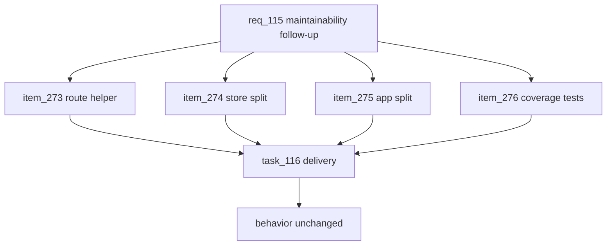

## prod_067_repo_review_maintainability_follow_up_product_brief - Repo Review Maintainability Follow-up Product Brief
> Date: 2026-07-24
> Status: Settled
> Related request: `req_115_repo_review_maintainability_follow_up`
> Related backlog: `item_273_centralize_leagues_route_error_guard_404_handling_behind_one_helper`
> Related task: `task_116_orchestrate_repo_review_maintainability_follow_up`
> Related architecture: (none yet)
> Reminder: Update status, linked refs, scope, decisions, success signals, and open questions when you edit this doc.
> Non-semantic edit: Added overview Mermaid diagram to satisfy companion-doc hygiene; no scope/status change.

# Overview
Act on the maintainability findings from the latest repo review: de-duplicate the leagues route error handling, keep splitting the oversized store and web root component, and close the branch-coverage gap, all without changing behavior or adding dependencies.

# Goals
- Remove the repeated error/guard/404 boilerplate in leagues/routes.ts behind one helper while keeping per-route messages.
- Keep every hand-written source file under a reasonable size ceiling (~800 lines).
- Make App.tsx a thin router over focused screen components.
- Lift branch coverage by testing the currently-uncovered error paths.

# Non-goals
- Do not change any handler behavior, status code, response body, transaction boundary, lock, or rule-error message.
- Do not alter the public import surface consumed by routes.ts, admin/store.ts, or tests.
- Do not add dependencies or introduce new architectural patterns beyond plain module/component files.
- Do not touch the Prisma schema, the simulation numerics, or the seeded PRNG.

# Scope and guardrails
- In: scaffolded request, product, backlog, orchestration task, validation, and handoff context.
- Out: unrelated workflow docs and implementation of generated tasks.

# Key product decisions
- Use structured input as the source of truth for generated docs.
- Keep generated write paths local and repo-bounded.

# Success signals
- Generated docs pass lint and audit without broad manual rewrites.
- Context-pack output can be handed to an implementation agent directly.

# References
- Product back-reference: `item_273_centralize_leagues_route_error_guard_404_handling_behind_one_helper`
- Task back-reference: `task_116_orchestrate_repo_review_maintainability_follow_up`
