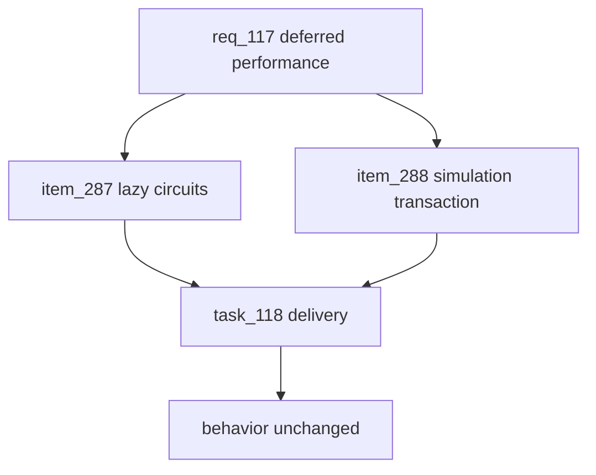

## prod_069_performance_pass_deferred_follow_up_product_brief - Performance Pass Deferred Follow-up Product Brief
> Date: 2026-07-24
> Status: Settled
> Related request: `req_117_performance_pass_deferred_follow_up`
> Related backlog: `item_287_lazy_load_circuit_route_data_per_selected_circuit`, `item_288_take_simulaterace_off_the_locked_write_transaction`
> Related task: `task_118_orchestrate_the_deferred_performance_follow_up`
> Related architecture: (none yet)
> Reminder: Update status, linked refs, scope, decisions, success signals, and open questions when you edit this doc.
> Non-semantic edit: Added overview Mermaid diagram to satisfy companion-doc hygiene; no scope/status change.

# Overview
Carry the two high-risk performance items deferred from req_116 as a dedicated, carefully-tested pass: lazy-load circuit route data off the critical path, and take the race simulation off the locked write transaction — both without changing visuals, results, or race-integrity guarantees.

# Goals
- Defer the 25-track route bundle off first paint via on-demand loading.
- Stop simulateRace from blocking the event loop and holding the row lock during a resolve.
- Prove both changes are behavior-neutral via the full gate.

# Non-goals
- No change to rendered visuals, simulation numerics, seed, transaction boundaries, or rule errors.
- No rewrite of the per-frame replay loop.
- No new dependencies unless a worker thread for the simulation is required.
- No schema/index changes.

# Scope and guardrails
- In: scaffolded request, product, backlog, orchestration task, validation, and handoff context.
- Out: unrelated workflow docs and implementation of generated tasks.

# Key product decisions
- Use structured input as the source of truth for generated docs.
- Keep generated write paths local and repo-bounded.

# Success signals
- Generated docs pass lint and audit without broad manual rewrites.
- Context-pack output can be handed to an implementation agent directly.

# References
- Product back-reference: `req_117_performance_pass_deferred_follow_up`
- Task back-reference: `task_118_orchestrate_the_deferred_performance_follow_up`
