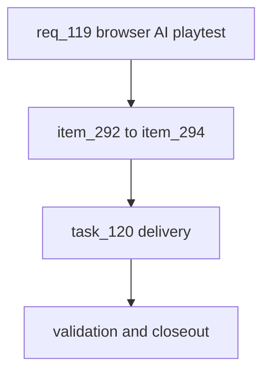

## prod_071_ai_playtest_surfaces_product_brief - AI Playtest Surfaces Product Brief
> Date: 2026-07-26
> Status: Settled
> Related request: `req_119_browser_driven_ai_playtest_an_agent_that_plays_the_real_ui_like_a_human_decisions_from_the_shared_playtest_brain`
> Related backlog: `item_292_extract_the_shared_playtest_brain_decisions_fun_frustration_into_one_module`, `item_293_build_the_playwright_browser_agent_that_plays_the_real_ui_from_the_shared_brain`, `item_294_instrument_the_browser_run_fun_frustration_report_ui_failure_capture_npm_wiring`
> Related task: `task_120_orchestrate_the_browser_driven_ai_playtest`
> Related architecture: (none yet)
> Reminder: Update status, linked refs, scope, decisions, success signals, and open questions when you edit this doc.
> Confidence: 90
> Semantic edit: 2026-07-27 settled after linked request/backlog/task closeout.
> Non-semantic edit: 2026-07-26 added overview Mermaid diagram.

# Overview
The league is validated by AI 'players' at two levels today: a pure-simulation persona tournament (ai-playtest) that measures balance and human feel via fun/frustration scores, and a store-level end-to-end run (simulate-playtest) that plays the real league lifecycle. Both are headless and blind to the UI. This request adds a third surface — an AI agent that plays the real browser UI like a human, driven by the same decision brain — so interaction and visual regressions get caught by the same personas that measure fun, and consolidates the decision heuristics into one shared brain instead of three copies.

# Goals
- One shared decision brain feeding all playtest surfaces, ending the duplication between ai-playtest and simulate-playtest.
- An AI that plays the real UI end-to-end like a human, catching interaction/visual regressions headless runs miss.
- The same fun/frustration instrumentation on the browser run as on the pure sim.
- A repeatable, seeded, scriptable run wired into npm.

# Non-goals
- Do not change the simulation engine, persona strategies, or the fun/frustration formulas; only relocate them.
- Do not replace the existing headless playtest tools.
- Do not make the browser run a required CI gate on day one.
- Do not add multi-browser or mobile matrices yet (chromium desktop first).

# Scope and guardrails
- In: scaffolded request, product, backlog, orchestration task, validation, and handoff context.
- Out: unrelated workflow docs and implementation of generated tasks.

# Key product decisions
- Use structured input as the source of truth for generated docs.
- Keep generated write paths local and repo-bounded.

# Success signals
- Generated docs pass lint and audit without broad manual rewrites.
- Context-pack output can be handed to an implementation agent directly.

# References
- Product back-reference: `req_119_browser_driven_ai_playtest_an_agent_that_plays_the_real_ui_like_a_human_decisions_from_the_shared_playtest_brain`
- Task back-reference: `task_120_orchestrate_the_browser_driven_ai_playtest`
