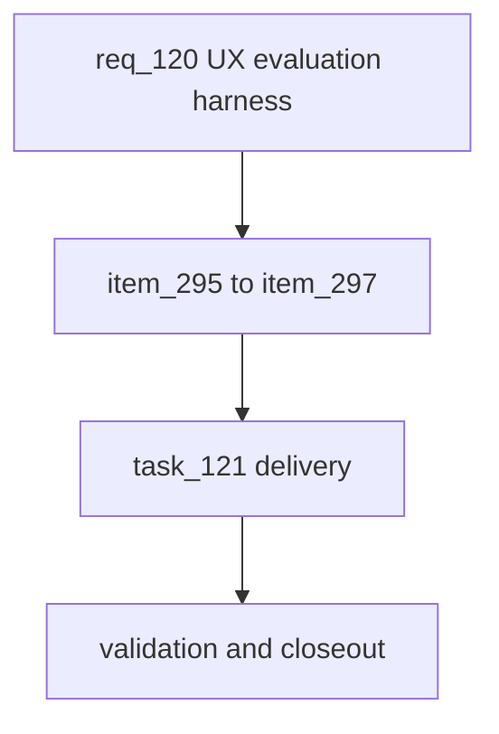

## prod_072_ai_ux_evaluation_product_brief - AI UX Evaluation Product Brief
> Date: 2026-07-26
> Status: Settled
> Related request: `req_120_ux_evaluation_harness_let_an_ai_judge_ui_ux_friction_and_onboarding_by_capturing_what_it_can_see_and_measure`
> Related backlog: `item_295_visual_playthrough_capture_screenshots_annotated_state_desktop_and_mobile`, `item_296_friction_accessibility_instrumentation_with_axe_core`, `item_297_cold_start_naive_agent_and_onboarding_funnel`
> Related task: `task_121_orchestrate_the_ux_evaluation_harness`
> Related architecture: (none yet)
> Reminder: Update status, linked refs, scope, decisions, success signals, and open questions when you edit this doc.
> Confidence: 90
> Semantic edit: 2026-07-27 settled after linked request/backlog/task closeout.
> Non-semantic edit: 2026-07-26 added overview Mermaid diagram.

# Overview
An AI can only judge experience it can see or measure. This harness turns a browser AI play session into the evidence needed to opine on UI/UX, friction, and onboarding: a visual playthrough gallery (desktop + mobile), a measured friction and accessibility report (including the first automated axe-core pass), and a cold-start onboarding funnel from a knowledge-free agent. It is built on the browser-driven playtest agent so capture and measurement wrap real navigation rather than a synthetic script, and it outputs artifacts a reviewer consumes to give a grounded UX opinion.

# Goals
- Make every AI play session a reviewable visual artifact on desktop and mobile.
- Quantify interaction friction and accessibility, not just outcomes.
- Measure first-time comprehension with a knowledge-free agent.
- Produce reviewer-ready evidence, reusing the existing browser agent and seeded backend.

# Non-goals
- Do not auto-judge UX quality PASS/FAIL; the harness produces evidence, the opinion is separate.
- Do not change the game UI or redesign onboarding here; that is per-finding downstream work.
- Do not add multi-browser matrices beyond one desktop + one mobile viewport.
- Do not replace the headless playtest tools or fork a second UI driver/brain.

# Scope and guardrails
- In: scaffolded request, product, backlog, orchestration task, validation, and handoff context.
- Out: unrelated workflow docs and implementation of generated tasks.

# Key product decisions
- Use structured input as the source of truth for generated docs.
- Keep generated write paths local and repo-bounded.

# Success signals
- Generated docs pass lint and audit without broad manual rewrites.
- Context-pack output can be handed to an implementation agent directly.

# References
- Product back-reference: `req_120_ux_evaluation_harness_let_an_ai_judge_ui_ux_friction_and_onboarding_by_capturing_what_it_can_see_and_measure`
- Task back-reference: `task_121_orchestrate_the_ux_evaluation_harness`
