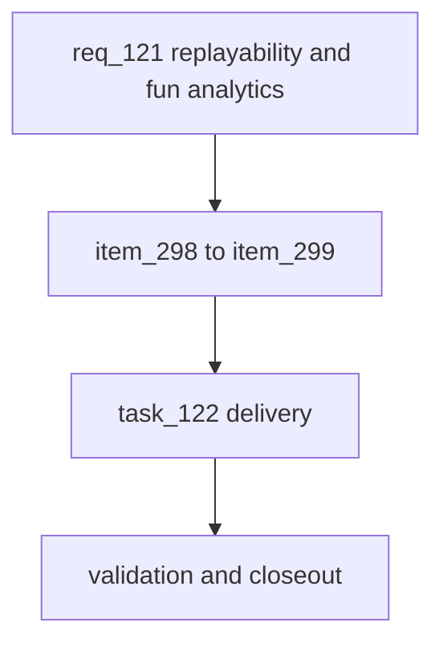

## prod_073_replayability_and_fun_analytics_product_brief - Replayability and Fun Analytics Product Brief
> Date: 2026-07-26
> Status: Proposed
> Related request: `req_121_replayability_and_fun_analytics_measure_outcome_variety_strategy_dominance_and_emotional_arc_across_many_ai_seasons`
> Related backlog: `item_298_replayability_metrics_variety_dominant_strategy_detection_comebacks_title_suspense`, `item_299_fun_arc_metrics_lead_changes_close_finishes_boring_race_rate_per_season`
> Related task: `task_122_orchestrate_replayability_and_fun_analytics`
> Related architecture: (none yet)
> Reminder: Update status, linked refs, scope, decisions, success signals, and open questions when you edit this doc.
> Confidence: 90
> Non-semantic edit: 2026-07-26 added overview Mermaid diagram.

# Overview
Our AI tournaments prove balance but not longevity: nothing measures whether outcomes stay varied, whether a single strategy dominates, how often comebacks and close finishes happen, or how much title suspense a season carries. This request adds post-hoc analytics over the simulation results the tools already produce — a replayability report (variety, dominance, comebacks, suspense) and a fun-arc report (lead changes, close finishes, boring-race rate) — with drill-down to the strategies, circuits, and rounds that drive them, so a designer or AI has measured evidence to judge replayability and fun.

# Goals
- Quantify replayability: outcome variety, strategy dominance, comebacks, title suspense.
- Quantify fun as a narrative arc, not a single score.
- Make findings actionable with drill-down to drivers.
- Reuse existing seeded simulations and results; no engine change.

# Non-goals
- Do not change the simulation engine, personas, circuit data, or fun/frustration formulas.
- Do not build the browser/visual UX harness here.
- Do not auto-tune balance from the findings.
- Do not add live/production analytics; this is offline over simulations.

# Scope and guardrails
- In: scaffolded request, product, backlog, orchestration task, validation, and handoff context.
- Out: unrelated workflow docs and implementation of generated tasks.

# Key product decisions
- Use structured input as the source of truth for generated docs.
- Keep generated write paths local and repo-bounded.

# Success signals
- Generated docs pass lint and audit without broad manual rewrites.
- Context-pack output can be handed to an implementation agent directly.

# References
- Product back-reference: `req_121_replayability_and_fun_analytics_measure_outcome_variety_strategy_dominance_and_emotional_arc_across_many_ai_seasons`
- Task back-reference: `task_122_orchestrate_replayability_and_fun_analytics`
