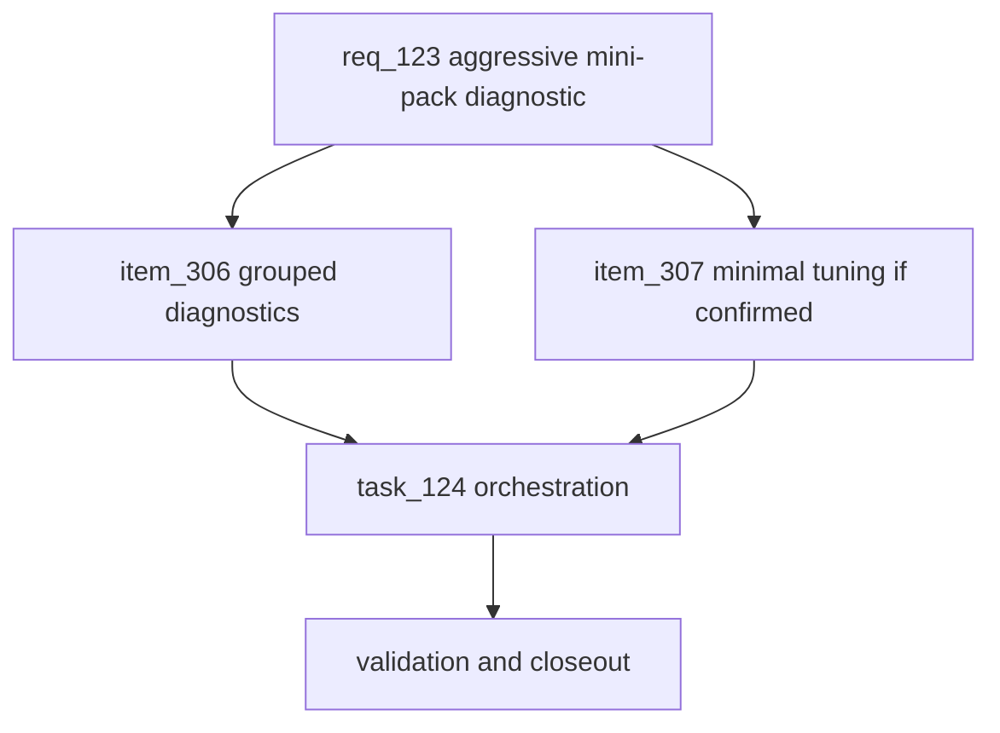

## prod_075_aggressive_mini_pack_balance_diagnostic_product_brief - Aggressive Mini-Pack Balance Diagnostic Product Brief
> Date: 2026-07-27
> Status: Settled
> Related request: `req_123_aggressive_mini_pack_balance_diagnostic_verify_and_correct_win_concentration_without_blind_nerfs`
> Related backlog: `item_306_group_replayability_and_balance_diagnostics_by_strategy_axes`
> Related task: `task_124_orchestrate_aggressive_mini_pack_balance_diagnostic`
> Related architecture: (none yet)
> Reminder: Update status, linked refs, scope, decisions, success signals, and open questions when you edit this doc.
> Non-semantic edit: 2026-07-27 added overview Mermaid diagram.

# Overview
The replayability report shows healthy variety overall but a visible concentration of wins around aggressive mini-pack lanes. This request adds grouped evidence and, only if needed, a minimal tuning pass so race strategy remains varied without killing comebacks, close finishes, or title suspense.

# Goals
- Turn the replayability finding into actionable balance evidence.
- Separate real strategy skew from sample size, circuit mix, and persona inventory effects.
- Preserve the current fun signals while improving strategic variety.
- Keep diagnostics deterministic, offline, and cheap to rerun.

# Non-goals
- Do not redesign the race engine or pit strategy system.
- Do not add new player-facing screens or telemetry.
- Do not nerf aggressive mini-pack blindly.
- Do not introduce a new analytics framework.

# Scope and guardrails
- In: scaffolded request, product, backlog, orchestration task, validation, and handoff context.
- Out: unrelated workflow docs and implementation of generated tasks.

# Key product decisions
- Use structured input as the source of truth for generated docs.
- Keep generated write paths local and repo-bounded.

# Success signals
- Generated docs pass lint and audit without broad manual rewrites.
- Context-pack output can be handed to an implementation agent directly.

# References
- Product back-reference: `item_306_group_replayability_and_balance_diagnostics_by_strategy_axes`
- Task back-reference: `task_124_orchestrate_aggressive_mini_pack_balance_diagnostic`
