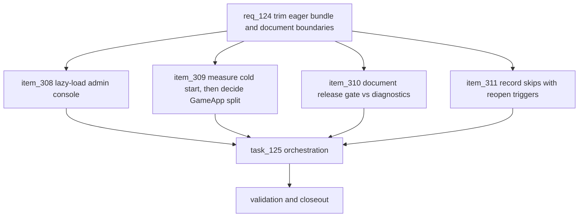

## prod_076_review_follow_up_product_brief - Review Follow-up Product Brief
> Date: 2026-07-27
> Status: Settled
> Related request: `req_124_trim_the_eager_web_bundle_and_document_script_and_skip_boundaries`
> Related backlog: `item_308_lazy_load_the_admin_console_out_of_the_eager_chunk`, `item_309_measure_cold_start_and_decide_the_gameapp_split_on_the_numbers`, `item_310_document_the_release_gate_and_diagnostic_script_split`, `item_311_record_the_app_tsx_and_speed_profile_skips_with_reopen_triggers`
> Related task: `task_125_orchestrate_the_review_follow_up`
> Related architecture: (none yet)
> Reminder: Update status, linked refs, scope, decisions, success signals, and open questions when you edit this doc.
> Semantic edit: Settled on 2026-07-27 because the linked request/backlog/task chain is Done and the roadmap records the work as shipped.

# Overview
Convert a clean repository review into the small amount of work it actually justified: one bundle cut that is free, one bundle cut gated on measurement, and the documentation that keeps both decisions and two deliberate skips legible to whoever reads the repo next.

# Goals
- Cut admin-only weight from the payload every player downloads.
- Gate the second, larger split on the cold-start evidence the project already generates.
- Make the script surface self-explanatory to a first-time contributor.
- Turn two deliberate skips into recorded decisions with triggers instead of unwritten intent.

# Non-goals
- Do not refactor App.tsx or split it into further modules.
- Do not convert the generated speed-profile data to JSON.
- Do not add a router, a bundle analyzer, or any new dependency.
- Do not change gameplay, API contracts, persistence, or visible copy.
- Do not restructure or prune the logics corpus; that is a separate concern.

# Scope and guardrails
- In: scaffolded request, product, backlog, orchestration task, validation, and handoff context.
- Out: unrelated workflow docs and implementation of generated tasks.

# Key product decisions
- Use structured input as the source of truth for generated docs.
- Keep generated write paths local and repo-bounded.

# Success signals
- Generated docs pass lint and audit without broad manual rewrites.
- Context-pack output can be handed to an implementation agent directly.

# References
- Product back-reference: `req_124_trim_the_eager_web_bundle_and_document_script_and_skip_boundaries`
- Task back-reference: `task_125_orchestrate_the_review_follow_up`
