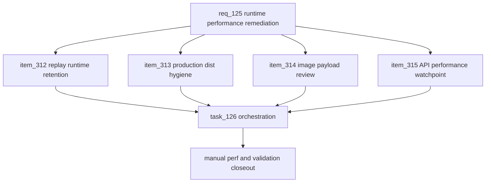

## prod_077_runtime_performance_remediation_product_brief - Runtime Performance Remediation Product Brief
> Date: 2026-07-27
> Status: Settled
> Related request: `req_125_runtime_performance_remediation_from_manual_perf_smoke_evidence`
> Related backlog: `item_312_reduce_replay_runtime_retention_in_timers_listeners_and_svg_state`, `item_313_verify_production_dist_hygiene_and_remove_accidental_shipped_artifacts`, `item_314_review_largest_image_payloads_for_cheap_measured_reductions`, `item_315_keep_api_simulation_performance_as_a_measured_watchpoint`
> Related task: `task_126_orchestrate_runtime_performance_remediation`
> Related architecture: (none yet)
> Reminder: Update status, linked refs, scope, decisions, success signals, and open questions when you edit this doc.
> Non-semantic edit: Added overview Mermaid diagram to satisfy companion-doc hygiene; no scope/status change.
> Semantic edit: Settled on 2026-07-27 because the linked request/backlog/task chain is Done and the roadmap records the work as shipped.

# Overview
Manual performance smoke tests show CR League's replay screen retains more heap, DOM nodes, and browser listeners than the normal GP loop, while network and API CPU are not currently the main bottlenecks. This brief prioritizes replay runtime cleanup, then lightweight build-output and asset hygiene, using the new manual perf tools for before/after proof without introducing CI perf gates.

# Goals
- Reduce replay runtime growth without changing player-facing replay behavior.
- Use perf:replay and perf:compare as the primary evidence loop.
- Confirm production build output does not contain accidental non-runtime artifacts.
- Review the largest shipped images for cheap byte reductions with visual safety.
- Keep API simulation performance measured but out of the first optimization path.

# Non-goals
- Do not add CI perf budgets, Lighthouse gates, dashboards, or new profiling dependencies.
- Do not redesign replay, map, race report, championship, garage, or navigation UX.
- Do not remove replay features to improve metrics.
- Do not change API contracts, replayTrace/result payload shape, or simulation behavior in this pass.
- Do not duplicate broad code-splitting work already covered by req_124 unless a tiny dist-hygiene fix is directly required.

# Scope and guardrails
- In: scaffolded request, product, backlog, orchestration task, validation, and handoff context.
- Out: unrelated workflow docs and implementation of generated tasks.

# Key product decisions
- Use structured input as the source of truth for generated docs.
- Keep generated write paths local and repo-bounded.

# Success signals
- Generated docs pass lint and audit without broad manual rewrites.
- Context-pack output can be handed to an implementation agent directly.

# References
- Product back-reference: `req_125_runtime_performance_remediation_from_manual_perf_smoke_evidence`
- Task back-reference: `task_126_orchestrate_runtime_performance_remediation`
