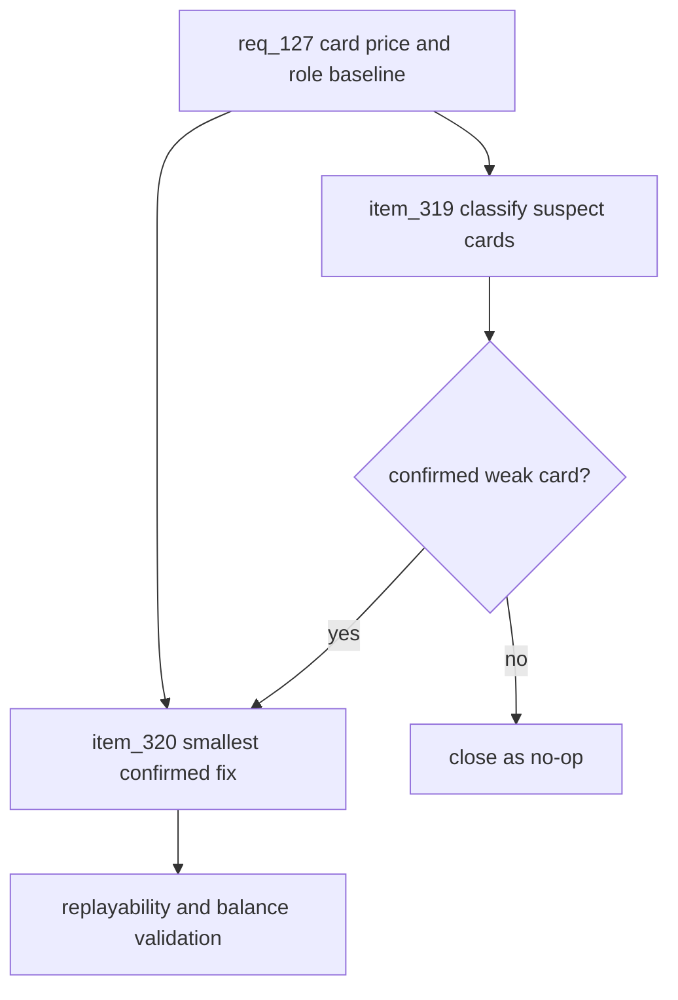

## prod_079_card_price_and_role_baseline_follow_up_product_brief - Card Price and Role Baseline Follow-up Product Brief
> Date: 2026-07-27
> Status: Proposed
> Related request: `req_127_card_price_and_role_baseline_follow_up_validate_weak_card_affordability_before_0_5_economy_expansion`
> Related backlog: `item_319_classify_suspect_card_price_and_role_gaps_from_the_latest_balance_evidence`, `item_320_apply_the_smallest_card_price_or_role_fix_only_for_confirmed_weak_cards`
> Related task: `task_128_orchestrate_card_price_and_role_baseline_follow_up`
> Related architecture: (none yet)
> Reminder: Update status, linked refs, scope, decisions, success signals, and open questions when you edit this doc.
> Non-semantic edit: Added overview Mermaid diagram to satisfy companion-doc hygiene; no scope/status change.

# Overview
The 0.5 economy gate is no longer blocked by tooling or card-effect honesty. Fresh replayability evidence says the game is varied enough to avoid a broad nerf, but balance evidence still shows several cards with weak role or affordability. This follow-up keeps the next economy move narrow: validate the suspect cards and adjust only the smallest existing price or effect if the evidence holds.

# Goals
- Turn the latest replayability and balance reports into a concrete 0.5 economy decision.
- Protect the healthy variety signals already measured.
- Give weak cards a real role only where the evidence confirms they need help.
- Avoid broad economy expansion until the current 15-card shop baseline is clean.

# Non-goals
- Do not add new cards, card families, draft shops, rarity, crafting, sponsors, or season rollover.
- Do not nerf aggressive mini-pack globally when replayability does not show a hard dominant cluster.
- Do not redesign pit strategy, qualifying, circuit traits, or simulation architecture.
- Do not add production telemetry or UI surfaces.

# Scope and guardrails
- In: scaffolded request, product, backlog, orchestration task, validation, and handoff context.
- Out: unrelated workflow docs and implementation of generated tasks.

# Key product decisions
- Use structured input as the source of truth for generated docs.
- Keep generated write paths local and repo-bounded.

# Success signals
- Generated docs pass lint and audit without broad manual rewrites.
- Context-pack output can be handed to an implementation agent directly.

# References
- Product back-reference: `req_127_card_price_and_role_baseline_follow_up_validate_weak_card_affordability_before_0_5_economy_expansion`
- Task back-reference: `task_128_orchestrate_card_price_and_role_baseline_follow_up`
