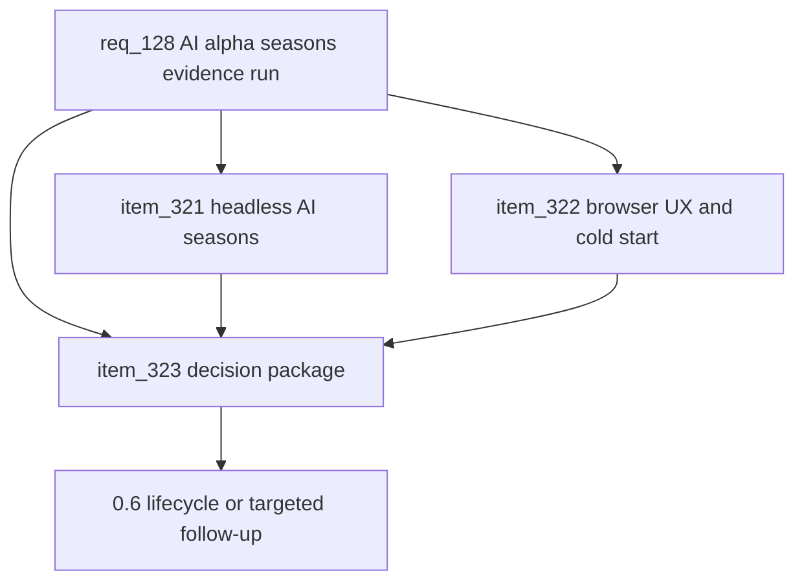

## prod_080_ai_alpha_seasons_evidence_run_product_brief - AI Alpha Seasons Evidence Run Product Brief
> Date: 2026-07-27
> Status: Proposed
> Related request: `req_128_ai_alpha_seasons_evidence_run_stress_the_season_loop_with_headless_and_browser_agents_before_0_6`
> Related backlog: `item_321_run_the_headless_ai_alpha_season_campaign`, `item_322_run_browser_ai_alpha_sessions_for_ui_friction_and_cold_start`, `item_323_write_the_alpha_seasons_decision_package`
> Related task: `task_129_orchestrate_the_ai_alpha_seasons_evidence_run`
> Related architecture: (none yet)
> Reminder: Update status, linked refs, scope, decisions, success signals, and open questions when you edit this doc.
> Non-semantic edit: Added overview Mermaid diagram to satisfy companion-doc hygiene; no scope/status change.

# Overview
Before opening the 0.6 beta-season lifecycle, run an AI alpha campaign that stresses CR League's season loop at two levels: large headless seasons for economy/replayability signals and smaller browser-driven sessions for real UI/friction/onboarding evidence. The output is a decision package, not a feature.

# Goals
- Produce enough AI-season evidence to choose the next roadmap move confidently.
- Separate scale balance problems from real-browser UX and onboarding problems.
- Keep all outputs durable, inspectable, and rerunnable by another agent.
- Avoid adding product scope until the evidence points to a specific next corpus.

# Non-goals
- Do not tune cards, add season mechanics, redesign UX, or implement 0.6 lifecycle inside this corpus.
- Do not add new analytics frameworks or production telemetry.
- Do not use browser runs as balance proof; use them for UI/friction/onboarding evidence.
- Do not require human players for this alpha run.

# Scope and guardrails
- In: scaffolded request, product, backlog, orchestration task, validation, and handoff context.
- Out: unrelated workflow docs and implementation of generated tasks.

# Key product decisions
- Use structured input as the source of truth for generated docs.
- Keep generated write paths local and repo-bounded.

# Success signals
- Generated docs pass lint and audit without broad manual rewrites.
- Context-pack output can be handed to an implementation agent directly.

# References
- Product back-reference: `req_128_ai_alpha_seasons_evidence_run_stress_the_season_loop_with_headless_and_browser_agents_before_0_6`
- Task back-reference: `task_129_orchestrate_the_ai_alpha_seasons_evidence_run`
