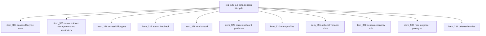

## prod_081_0_6_beta_season_lifecycle_and_league_management_product_brief - 0.6 Beta Season Lifecycle and League Management Product Brief
> Date: 2026-07-27
> Status: Proposed
> Related request: `req_129_0_6_beta_season_lifecycle_and_league_management_private_seasons_commissioner_tools_actionability_rivals_team_identity_and_optional_economy_variants`
> Related backlog: `item_324_build_the_beta_season_lifecycle_core`, `item_325_add_commissioner_league_management_with_manual_reminders_and_share_controls`, `item_326_close_the_beta_accessibility_gate_without_redesigning_the_app`, `item_327_make_post_race_feedback_more_actionable_and_connect_it_to_the_next_grand_prix`, `item_328_introduce_a_non_mandatory_rival_thread_across_standings_and_reports`, `item_329_add_contextual_card_guidance_in_plan_and_garage`, `item_330_add_lightweight_team_identity_and_public_in_league_team_profiles`, `item_331_add_an_optional_variable_shop_mode_at_league_creation`, `item_332_define_the_lightweight_season_economy_continuity_rule`, `item_333_prototype_deterministic_race_engineer_profile_recommendations`, `item_334_record_deferred_modes_and_non_goals_so_0_6_stays_focused`
> Related task: `task_130_orchestrate_the_0_6_beta_season_lifecycle_and_league_management_corpus`
> Related architecture: (none yet)
> Reminder: Update status, linked refs, scope, decisions, success signals, and open questions when you edit this doc.
> Non-semantic edit: Added overview Mermaid diagram to make the 0.6 corpus slices easier to scan.

# Overview
Deliver the first real private beta season layer for CR League: a season can run across several Grands Prix, the league creator can manage readiness and manual reminders from one place, players get clearer race/rival/card guidance, and optional identity/economy variants are introduced only where they improve repeated private-league play.

# Goals
- Make one private league season operable by its creator without manual support.
- Keep beta readiness grounded in the current loop instead of adding a new mode.
- Improve comprehension and decision quality through deterministic explanations.
- Preserve the current visual direction while closing accessibility blockers.
- Separate required beta lifecycle work from optional flavor and later-mode ideas.

# Non-goals
- Do not redesign the app visually beyond accessibility and contrast corrections.
- Do not add automatic scheduled reminders, polling/SSE, or bot replacement unless a later beta evidence gate proves it.
- Do not implement arcade solo, quick play matchmaking, public leagues, compact replay, or a tutorial rewrite in this corpus.
- Do not make secondary objectives mandatory.
- Do not add generative AI calls, a production telemetry platform, or broad card-economy expansion.

# Scope and guardrails
- In: scaffolded request, product, backlog, orchestration task, validation, and handoff context.
- Out: unrelated workflow docs and implementation of generated tasks.

# Key product decisions
- Use structured input as the source of truth for generated docs.
- Keep generated write paths local and repo-bounded.

# Success signals
- Generated docs pass lint and audit without broad manual rewrites.
- Context-pack output can be handed to an implementation agent directly.

# References
- Product back-reference: `req_129_0_6_beta_season_lifecycle_and_league_management_private_seasons_commissioner_tools_actionability_rivals_team_identity_and_optional_economy_variants`
- Task back-reference: `task_130_orchestrate_the_0_6_beta_season_lifecycle_and_league_management_corpus`
