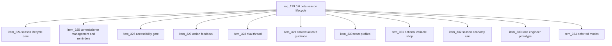

## prod_081_0_6_beta_season_lifecycle_and_league_management_product_brief - 0.6 Beta Season Lifecycle and League Management Product Brief
> Date: 2026-07-27
> Status: Proposed
> Related request: `req_129_0_6_beta_season_lifecycle_and_league_management_private_seasons_commissioner_tools_actionability_rivals_team_identity_and_optional_economy_variants`
> Related backlog: `item_324_build_the_beta_season_lifecycle_core`, `item_325_add_commissioner_league_management_with_manual_reminders_and_share_controls`, `item_326_close_the_beta_accessibility_gate_without_redesigning_the_app`, `item_327_make_post_race_feedback_more_actionable_and_connect_it_to_the_next_grand_prix`, `item_328_introduce_a_non_mandatory_rival_thread_across_standings_and_reports`, `item_329_add_contextual_card_guidance_in_plan_and_garage`, `item_330_add_lightweight_team_identity_and_public_in_league_team_profiles`, `item_331_add_an_optional_variable_shop_mode_at_league_creation`, `item_332_define_the_lightweight_season_economy_continuity_rule`, `item_333_prototype_deterministic_race_engineer_profile_recommendations`, `item_334_record_deferred_modes_and_non_goals_so_0_6_stays_focused`
> Related task: `task_130_orchestrate_the_0_6_beta_season_lifecycle_and_league_management_corpus`
> Related architecture: (none yet)
> Reminder: Update status, linked refs, scope, decisions, success signals, and open questions when you edit this doc.
> Non-semantic edit: Added overview Mermaid diagram to make the 0.6 corpus slices easier to scan.
> Semantic edit: Owner clarified that manual reminder emails are capped to one send per season for the first implementation.
> Semantic edit: Recorded owner decisions for first-pass presets, GP resolution, absent-player defaults, season rollover, rival/card/team/shop rules, and race-engineer deferral.
> Semantic edit: Recorded owner UX guardrails for polished commissioner screens and compatibility with the existing card affinity signal.
> Semantic edit: Recorded final UX micro-decisions for Direction de course placement, reminder wording, card guidance labels, team profile entry points, variable shop copy, and season-end state.

# Overview
Deliver the first real private beta season layer for CR League: a season can run across several Grands Prix, the league creator can manage readiness and manual reminders from one place, players get clearer race/rival/card guidance, and optional identity/economy variants are introduced only where they improve repeated private-league play.

# Goals
- Make one private league season operable by its creator without manual support.
- Keep beta readiness grounded in the current loop instead of adding a new mode.
- Improve comprehension and decision quality through deterministic explanations.
- Preserve the current visual direction while closing accessibility blockers.
- Make commissioner tools feel native to CR League rather than like a generic admin dashboard.
- Separate required beta lifecycle work from optional flavor and later-mode ideas.

# Non-goals
- Do not redesign the app visually beyond accessibility and contrast corrections.
- Do not add automatic scheduled reminders, polling/SSE, or bot replacement unless a later beta evidence gate proves it.
- Do not implement arcade solo, quick play matchmaking, public leagues, compact replay, or a tutorial rewrite in this corpus.
- Do not make secondary objectives mandatory.
- Do not add generative AI calls, a production telemetry platform, or broad card-economy expansion.

# Scope and guardrails
- In: scaffolded request, product, backlog, orchestration task, validation, and handoff context.
- Out: unrelated workflow docs and implementation of generated tasks.

# Key product decisions
- Use structured input as the source of truth for generated docs.
- Keep generated write paths local and repo-bounded.

# Open Questions and Proposed Approaches
- Broad corpus risk: implement in strict order. Ship season lifecycle, commissioner management, and accessibility first; then add action feedback, rival context, and card guidance. Team profiles, variable shop, season economy, and race-engineer recommendations must prove they still fit after the core beta loop works.
- Season lifecycle: ship exactly two presets first, `Quick beta` at 3 GP and `Standard season` at 6 GP, with `Standard season` as the default. Do not add custom season length until beta operators ask for it.
- GP resolution and absences: do not auto-resolve. The commissioner gets a resolve action when all plans are ready and a separate resolve-with-defaults path when players are absent. Defaults must be visible before resolution and named in the report after resolution. Use one neutral default plan for 0.6: balanced setup, no card, medium strategy.
- Season end: require an explicit commissioner action to start the next season so players can inspect champion, podium, and palmares state before rollover. Use a `Saison terminée` state with podium/palmares and a creator-only `Lancer la saison suivante` action.
- Season economy continuity: avoid leader snowball. For the first pass, preserve players, palmares, archived season stats, and cosmetic/team identity while resetting cards and credits. If later evidence asks for carry-over, cap credits around 25-35% and require balance evidence.
- Manual reminder emails: keep the admin in control and cap the first implementation to one send per season. Add one commissioner action labeled `Relancer les retardataires` that targets only players with pending plans and usable profile email data, reports sent/skipped recipients, refuses repeat sends for the same season with `Rappel déjà envoyé cette saison`, and never schedules automatic reminders. Store minimal audit fields: `reminderSentAt`, `reminderSentBy`, `reminderSeasonNumber`, `sentCount`, and `skippedCount`.
- Commissioner permissions: enforce owner-only mutations in the API. The web screen is not the security boundary; tests must prove non-creators cannot resolve, remind, or change league-management settings. For 0.6, commissioner means the league creator only; no transfer or co-admin role.
- Commissioner UX: expose creator controls inside the existing league context as `Direction de course`, via a creator-only tab or button rather than a hidden standalone route. Design it as a CR League control room with clear race-state hierarchy, readiness lanes, compact action groups, and existing visual components. Avoid a generic SaaS table-first admin page. On mobile, use stacked sections; only use sticky actions if that pattern already exists in the app.
- Accessibility without redesign: fix labels, ARIA, heading structure, contrast, and tap targets locally. Preserve layout, art direction, component shapes, and copy hierarchy unless contrast or target size requires a minimal adjustment.
- Rival thread: derive a rival only when standings data makes it meaningful. Prefer the nearest standings neighbor, human or bot. If the first race has no points or the nearest-neighbor signal is ambiguous, show no rival rather than forcing a fake story. Tie-break equal candidates by standings proximity, then points gap, then stable team id.
- Card guidance: use exactly three French labels first: `Utile ici`, `Situationnel`, and `Impact faible`, each with one short deterministic reason. Replace the existing `card_fit_recommended` / "Affinité haute" surface in the same UI pass or map it to `Utile ici`; do not show duplicate recommendation badges. Avoid “best card” language, full rankings, hidden scoring explanations, numeric scores, and auto-pick.
- Variable shop: make it an explicit advanced league-creation option labeled `Boutique variable à chaque GP`, disabled by default, with copy explaining that it changes available cards between races. When enabled, rotate a deterministic 6-card shop every GP using league/season/round data and freeze the GP selection so catalog changes do not rewrite historical shops. Fixed-shop leagues remain the balance baseline.
- Team profile: start from existing data and keep the profile visible only inside the league. Open it from standings and player/team cards. Show name, car/livery, championship position, season stats, palmares, current rival, and derived style before adding deeper cosmetics, uploads, bios, or public internet pages. First editable fields should be limited to existing safe team name and livery/color support.
- Race-engineer assistant: do not ship in the first lot if card guidance makes the Plan screen clear enough. If later pulled in, keep it deterministic and optional with `Safe points`, `Attack`, and `Weather read` profiles; allow applying a profile but never submit automatically and never require generative AI.
- Deferred ideas: keep optional secondary objectives, arcade solo, quick play matchmaking, onboarding/tutorial rewrite, compact replay/highlights, automatic reminders, polling/SSE, and 1.0 hardening out of this corpus unless the user explicitly changes scope.

# Success signals
- Generated docs pass lint and audit without broad manual rewrites.
- Context-pack output can be handed to an implementation agent directly.

# References
- Product back-reference: `req_129_0_6_beta_season_lifecycle_and_league_management_private_seasons_commissioner_tools_actionability_rivals_team_identity_and_optional_economy_variants`
- Task back-reference: `task_130_orchestrate_the_0_6_beta_season_lifecycle_and_league_management_corpus`
