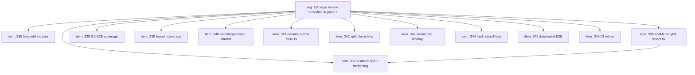

## prod_082_repo_review_remediation_pass_7_product_brief - Repo Review Remediation Pass 7 Product Brief
> Date: 2026-07-28
> Status: Proposed
> Related request: `req_130_repo_review_remediation_pass_7_db_indexes_test_fake_drift_0_6_e2e_coverage_code_organization_and_admin_session_hardening`
> Related backlog: `item_335_add_missing_leagueid_indexes_on_team_and_grandprix`, `item_336_fix_testmemorydb_s_silent_select_handling`, `item_337_harden_testmemorydb_against_further_include_mutation_count_drift`, `item_338_add_e2e_coverage_for_the_0_6_corpus_s_highest_risk_flows`, `item_339_raise_branch_coverage_on_weak_replay_timing_files`, `item_340_move_standings_rival_derivation_logic_into_packages_shared`, `item_341_rename_admin_store_ts_to_reflect_its_actual_content`, `item_342_split_lifecycle_ts_by_responsibility`, `item_343_rate_limit_all_admin_routes`, `item_344_hash_team_claimcode_at_rest_with_a_backward_compatible_migration`, `item_345_replace_hardcoded_e2e_copy_assertions_with_data_testid`, `item_346_add_ci_only_playwright_retries_if_flakiness_is_evidenced`
> Related task: `task_131_orchestrate_repo_review_remediation_pass_7`
> Related architecture: (none yet)
> Reminder: Update status, linked refs, scope, decisions, success signals, and open questions when you edit this doc.
> Non-semantic edit: Added overview Mermaid diagram to make the pass-7 corpus slices easier to scan.

# Overview
A seventh remediation pass driven by the post-v0.6.0 full-repo review: index the hottest query path, stop the in-memory Prisma test fake from silently diverging from real Prisma semantics, close the 0.6 corpus's E2E coverage gap, shore up a razor-thin coverage threshold, relocate stranded domain logic into packages/shared, remove two code-organization traps, close an admin-route rate-limiting gap and a plaintext-claim-code exposure, and reduce E2E fragility from hardcoded copy assertions.

# Goals
- The most common DB query path (filtering by leagueId) is indexed.
- The in-memory Prisma test fake can no longer silently return data shaped differently than real Prisma would.
- The 0.6 corpus's highest-risk flows (commissioner screen, variable shop, team profiles) have real E2E coverage.
- The enforced branch-coverage threshold has real margin instead of a hair's-breadth pass.
- Standings/rival domain logic is reusable from the API, not stranded in the web app, and the two 'rival' concepts are no longer confusable.
- A new contributor or AI agent grepping this codebase does not land in the wrong file due to a misleading filename, and lifecycle.ts's responsibilities are each easy to find.
- Admin routes are rate-limited like every other write route, and a team's claim code is no longer recoverable in plaintext from a DB dump.
- E2E assertions on copy strings only break when the copy actually needs to be re-verified, not on every unrelated rename.

# Non-goals
- No new user-facing features or product design; this is an internal engineering-quality corpus.
- Do not migrate qualifyingRuns, cards, or other JSON columns to relational tables in this corpus; that stays a future evidence-gated item.
- Do not replace testMemoryDb.ts with a real ephemeral Postgres test harness; only harden the existing fake.
- Do not build an explicit team-ownership-transfer UX or rework the broader auth/session model beyond hashing claimCode.
- Do not add Playwright retries speculatively without evidence of real flakiness.

# Scope and guardrails
- In: scaffolded request, product, backlog, orchestration task, validation, and handoff context.
- Out: unrelated workflow docs and implementation of generated tasks.

# Key product decisions
- Use structured input as the source of truth for generated docs.
- Keep generated write paths local and repo-bounded.

# Success signals
- Generated docs pass lint and audit without broad manual rewrites.
- Context-pack output can be handed to an implementation agent directly.

# References
- Product back-reference: `req_130_repo_review_remediation_pass_7_db_indexes_test_fake_drift_0_6_e2e_coverage_code_organization_and_admin_session_hardening`
- Task back-reference: `task_131_orchestrate_repo_review_remediation_pass_7`
