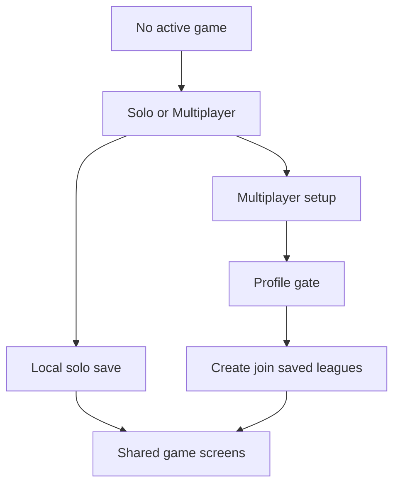

## prod_083_solo_multiplayer_entry_and_local_solo_mode_product_brief - Solo / Multiplayer Entry And Local Solo Mode Product Brief
> Date: 2026-07-28
> Status: Settled
> Related request: `req_131_solo_and_multiplayer_entry_split_with_local_solo_mode`
> Related backlog: `item_347_introduce_the_solo_multiplayer_setup_hierarchy`
> Related task: `task_132_orchestrate_solo_multiplayer_entry_and_local_solo_mode`
> Related architecture: `adr_009_shared_local_and_network_league_engine`
> Non-semantic edit: Added overview Mermaid diagram to satisfy companion-doc hygiene; no scope/status change.
> Semantic edit: 2026-07-28 captured confirmed Solo-before-profile, V1 no-API scope, single local save, explicit solo reset, and shared engine architecture.
> Reminder: Update status, linked refs, scope, decisions, success signals, and open questions when you edit this doc.

# Overview
CR League gets a clearer entry hierarchy: after the splash, the player first chooses Solo or Multiplayer. Solo starts or resumes a one-device local season before any profile setup. Multiplayer preserves the existing profile-backed Create / Join private league flow. Both modes should share the same LeagueState shape, game screens, and mutable league engine so the local loop does not drift from the networked loop.

# Goals
- Make the product structure obvious: Solo is immediate and local; Multiplayer is private league play with create/join and saved leagues.
- Give players and testers a no-network way to play the core loop end to end using the same Plan, Drive, Garage, Championship, Replay, and Report surfaces.
- Reduce setup friction for players who only want to try the game alone before creating a profile or joining a private league.
- Keep the implementation maintainable by extracting shared league rules into `packages/shared`, then using thin persistence adapters for API-backed multiplayer and localStorage-backed solo.

# Non-goals
- No cloud sync, account recovery, invite code, or cross-device transfer for solo V1.
- No multiple solo save slots or campaign selection screen in this slice.
- No service worker/PWA offline packaging requirement; the feature means no API calls once the web app is loaded.
- No duplicated solo-only game engine and no duplicated Solo-only game screens.
- No changes to multiplayer backend contracts beyond what is strictly necessary to keep shared types compiling.

# Scope and guardrails
- In: Solo / Multiplayer mode choice before profile, multiplayer routed through the existing profile and league setup gates, a single versioned solo save slot, explicit solo reset, shared engine extraction, and focused no-fetch tests.
- Out: multiple solo saves, cloud sync, import/export, PWA offline packaging, public matchmaking, and a separate solo rules engine.

# Key product decisions
- Entry order is fixed: root splash -> Solo / Multiplayer. Solo bypasses profile; Multiplayer requires the existing profile setup/recovery flow before Create / Join.
- Solo V1 means local no-API mode after the web app is loaded, not full installable/offline PWA mode.
- Solo persistence is one local slot, recommended key `cr-league-solo-save-v1`, containing LeagueState plus schemaVersion, createdAt, and updatedAt metadata.
- Solo reset is a dedicated confirmed command that only clears solo storage. Multiplayer logout/forget flows do not clear solo progress.
- The league engine is mutualized in `packages/shared`; API and solo web code are persistence adapters around the same rules.

# Success signals
- Multiplayer create/join/rejoin behavior is unchanged after the entry split.
- Solo starts before profile, survives reload, and can complete the first GP loop with fetch mocked to fail.
- Shared engine functions are used by both API-backed multiplayer and local solo actions.
- The UI visibly labels the active local save as Solo local and provides a safe reset path.
- Typecheck, focused tests, web build, and Logics validation pass.

# Delivery Checkpoints
- 2026-07-28: Entry split, single local save storage, shared-engine helper extraction, and first solo start/action adapter slice are in place. Solo can start before profile with no API call and can persist shared-engine directive/card/livery/name mutations locally.
- 2026-07-28: The active local game now carries a `Solo local` badge and a confirmed reset path that deletes only the solo save.
- 2026-07-28: Solo chrono is no-fetch and backed by shared qualification generation.
- 2026-07-28: Solo can now resolve the GP and start the next round locally with persisted replay/report output.
- 2026-07-28: Solo garage can now unlock and equip paid car assets locally through the shared engine without API calls.
- 2026-07-28: Solo hides the API-only league controls surface, keeping settings/reminders/restart in the multiplayer path.
- 2026-07-28: Multiplayer garage/card/team identity mutations now run through the shared engine before DB persistence, aligning the common team-action rules with Solo.
- 2026-07-28: Multiplayer GP resolution and next-GP lifecycle now run through shared engine state transitions while preserving DB-specific seeds, shops, bot fill, bot purchases, and season rollover behavior.
- Success signals are implemented and validated; final Logics closeout is in progress.

# References
- Product back-reference: `item_347_introduce_the_solo_multiplayer_setup_hierarchy`
- Task back-reference: `task_132_orchestrate_solo_multiplayer_entry_and_local_solo_mode`
- Architecture back-reference: `adr_009_shared_local_and_network_league_engine`
