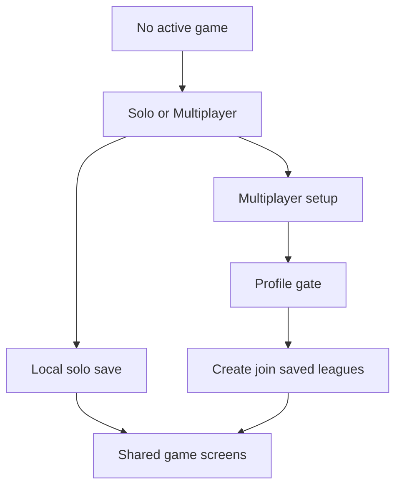

## prod_083_solo_multiplayer_entry_and_local_solo_mode_product_brief - Solo / Multiplayer Entry And Local Solo Mode Product Brief
> Date: 2026-07-28
> Status: Proposed
> Related request: `req_131_solo_and_multiplayer_entry_split_with_local_solo_mode`
> Related backlog: `item_347_introduce_the_solo_multiplayer_setup_hierarchy`, `item_348_build_local_solo_state_persistence_and_action_adapter`, `item_349_polish_solo_multiplayer_affordances_and_reset_safety`
> Related task: `task_132_orchestrate_solo_multiplayer_entry_and_local_solo_mode`
> Related architecture: (none yet)
> Non-semantic edit: Added overview Mermaid diagram to satisfy companion-doc hygiene; no scope/status change.
> Reminder: Update status, linked refs, scope, decisions, success signals, and open questions when you edit this doc.

# Overview
CR League gets a clearer entry hierarchy: the player first chooses Solo or Multiplayer. Multiplayer preserves the existing profile-backed Create / Join private league flow. Solo creates or resumes a one-device local season with bots and reuses the same game screens and race loop without any network dependency.

# Goals
- Make the product structure obvious: Solo is immediate and local; Multiplayer is private league play with create/join and saved leagues.
- Give players and testers a no-network way to play the core loop end to end using the same Plan, Drive, Garage, Championship, Replay, and Report surfaces.
- Reduce setup friction for players who only want to try the game alone before creating a profile or joining a private league.
- Keep the implementation maintainable by reusing LeagueState and existing game views, and by isolating the storage/action differences behind a small local solo boundary.

# Non-goals
- No cloud sync, account recovery, invite code, or cross-device transfer for solo V1.
- No multiple solo save slots or campaign selection screen in this slice.
- No service worker/PWA offline packaging requirement; the feature means no API calls once the web app is loaded.
- No rewrite of the shared race engine or duplicated Solo-only game screens.
- No changes to multiplayer backend contracts beyond what is strictly necessary to keep shared types compiling.

# Scope and guardrails
- In: scaffolded request, product, backlog, orchestration task, validation, and handoff context.
- Out: unrelated workflow docs and implementation of generated tasks.

# Key product decisions
- Use structured input as the source of truth for generated docs.
- Keep generated write paths local and repo-bounded.

# Success signals
- Generated docs pass lint and audit without broad manual rewrites.
- Context-pack output can be handed to an implementation agent directly.

# References
- Product back-reference: `req_131_solo_and_multiplayer_entry_split_with_local_solo_mode`
- Task back-reference: `task_132_orchestrate_solo_multiplayer_entry_and_local_solo_mode`
