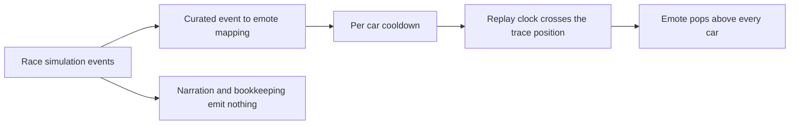

## prod_084_race_replay_driver_emotes_product_brief - Race Replay Driver Emotes Product Brief
> Date: 2026-07-29
> Status: Settled
> Related request: `req_132_pop_driver_reaction_emotes_above_cars_during_the_replay`
> Related backlog: `item_350_map_race_events_to_a_curated_emote_vocabulary`
> Related task: `task_133_orchestrate_race_replay_driver_emotes`
> Related architecture: (none yet)
> Reminder: Update status, linked refs, scope, decisions, success signals, and open questions when you edit this doc.

# Overview
Make the replay read as a race rather than a table of positions by having each car react to what happens to it, using event data the simulation already produces and a rendering slot that already exists.

# Overview Diagram

# Goals
- Attach a visible reaction to the incidents that already drive the race narrative.
- Cover every car so rivalries read from the map, not only the player's own run.
- Hold the number of reactions low enough that each one still registers.
- Reuse the existing pop machinery, rendering slot and asset pipeline.

# Non-goals
- Do not add player-authored or live chat emotes; the reaction is derived from the simulation.
- Do not restate what the race director banner, the key moments list or the report already narrate.
- Do not change the race simulation, its event types or its balance.
- Do not introduce a second animation system, a sprite atlas runtime, or a new image dependency.

# Scope and guardrails
- In: scaffolded request, product, backlog, orchestration task, validation, and handoff context.
- Out: unrelated workflow docs and implementation of generated tasks.

# Key product decisions
- Use structured input as the source of truth for generated docs.
- Keep generated write paths local and repo-bounded.

# Success signals
- Generated docs pass lint and audit without broad manual rewrites.
- Context-pack output can be handed to an implementation agent directly.

# References
- Product back-reference: `item_350_map_race_events_to_a_curated_emote_vocabulary`
- Task back-reference: `task_133_orchestrate_race_replay_driver_emotes`
