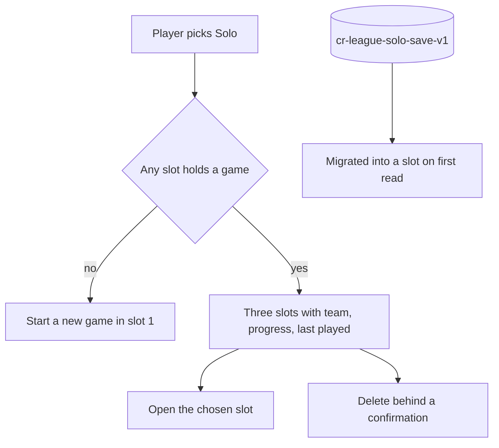

## prod_085_solo_save_slots_product_brief - Solo Save Slots Product Brief
> Date: 2026-07-29
> Status: Settled
> Related request: `req_133_offer_three_solo_save_slots_with_readable_state`
> Related backlog: `item_353_bound_what_a_solo_save_costs_in_storage`, `item_354_store_solo_games_in_three_slots_with_a_light_index`, `item_355_pick_a_solo_slot_from_the_entry_screen`
> Related task: `task_134_orchestrate_solo_save_slots`
> Related architecture: (none yet)
> Reminder: Update status, linked refs, scope, decisions, success signals, and open questions when you edit this doc.

# Overview
Turn solo from one overwritable game into three parallel runs a player can recognise at a glance, without making the first run longer or pushing local storage past its limit.

# Overview Diagram

# Goals
- Let several solo seasons coexist on one device.
- Make each slot self-describing: whose team, how far along, how recently played.
- Keep the shortest path to a first race unchanged.
- Bound what a solo game costs in storage so slots stay safe to add.

# Non-goals
- No cloud sync, no cross-device solo, no profile requirement for solo.
- No slot renaming, import, export or duplication in this slice.
- No change to multiplayer saved leagues or their storage.
- No change to the race simulation or its output shape.

# Scope and guardrails
- In: scaffolded request, product, backlog, orchestration task, validation, and handoff context.
- Out: unrelated workflow docs and implementation of generated tasks.

# Key product decisions
- Use structured input as the source of truth for generated docs.
- Keep generated write paths local and repo-bounded.

# Success signals
- Generated docs pass lint and audit without broad manual rewrites.
- Context-pack output can be handed to an implementation agent directly.

# References
- Product back-reference: `req_133_offer_three_solo_save_slots_with_readable_state`
- Task back-reference: `task_134_orchestrate_solo_save_slots`
