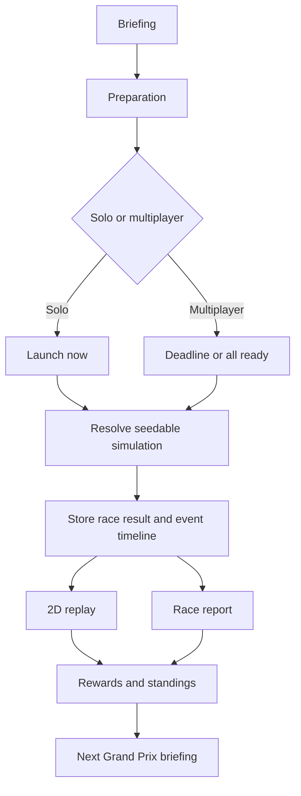

## spec_001_grand_prix_core_loop_and_simulation_v1 - Grand Prix Core Loop and Simulation V1
> From version: 1.0.0
> Schema version: 1.0
> Status: Settled
> Understanding: 90%
> Confidence: 85%
> Date: 2026-07-13
> Related request: `req_001_define_grand_prix_core_loop_and_simulation_v1`
> Related backlog: `item_007_define_grand_prix_core_loop_and_simulation_v1`
> Related task: `task_002_define_grand_prix_core_loop_and_simulation_v1`
> Related product: `prod_001_cr_league_product_brief`

# Purpose
This spec defines the first playable Grand Prix loop and the V1 race simulation contract for CR League.

The goal is not realism. The goal is a race that feels fair, dramatic, and explainable after the player makes a few pre-race decisions.

Core design rule:

> Every Grand Prix should produce a result, an explanation, and at least one memorable race story.

# Design Principles
- Keep the mandatory player action short: a casual player should prepare a Grand Prix in about two minutes.
- Hide formulas from the player, but make consequences visible through replay and report.
- Prefer readable risk over hidden complexity.
- Use the same race engine for solo and multiplayer.
- Make simulation seedable and reproducible.
- Generate an event timeline first; replay and report are views of that timeline.
- Do not require live in-race input in V1.

# Grand Prix Phase Flow


# Phase Details
## 1. Briefing
The briefing is the player's decision surface.

Required briefing data:

- Grand Prix name.
- Circuit type: one primary trait and one secondary trait.
- Weather forecast as probability, not certainty.
- Grid or starting order approximation if available.
- Current championship standings.
- Current rival suggestion.
- Player credits and cards available.
- Deadline or launch state.

Example circuit traits:

- Fast: rewards speed preparation and aggressive approach.
- Technical: rewards balanced execution and punishes high risk.
- Urban: raises error probability and makes overtaking harder.
- High wear: raises reliability and tire-risk events.
- Weather-sensitive: amplifies weather preparation and weather cards.

Example weather forecast:

- Dry 65%, light rain 25%, heavy rain 10%.

The player should understand the tradeoff without seeing formulas:

- "Fast circuit, mostly dry, but rain risk is real."
- "Aggressive plans can gain early places here, but reliability pressure is high."

## 2. Preparation
V1 has three mandatory choices.

### Race Approach
- Prudent: lower upside, lower error and reliability risk.
- Balanced: moderate upside, moderate risk.
- Aggressive: higher upside, higher error and reliability risk.

### Technical Preparation
- Speed: improves pace, especially on fast circuits.
- Reliability: reduces mechanical and late-race failure risk.
- Weather Adaptation: reduces downside when weather changes or forecast is wrong.

### Special Plan
One of:

- Play one card.
- Target a rival objective.
- No special move.

V1 can represent rival targeting as an objective even before advanced rival cards exist.

## 3. Lock Or Launch
Solo:

- The player can launch the Grand Prix immediately.
- Bots auto-submit their plans.

Multiplayer:

- Players submit plans before a deadline.
- The race resolves when the deadline passes or all players are ready, whichever rule the league uses.
- Default V1 recommendation: resolve when all players are ready, otherwise at deadline.
- Missing players use a default plan: Balanced approach, Reliability preparation, no card.

## 4. Resolution
The server resolves the race exactly once.

Resolution requirements:

- Race has a stored seed.
- Race inputs are persisted before resolution.
- Resolution is idempotent.
- Final result and event timeline are stored.
- Replay and report can be regenerated from stored output without rerunning the race.

## 5. Replay
Replay is a short visualization of the event timeline.

V1 target:

- 30 to 60 seconds.
- Top-down 2D circuit.
- Cars represented by team colors or simple icons.
- Event callouts for major moments.
- Weather state visible.
- Position changes visible enough to follow the top five and the player.

The replay is not the source of truth. The event timeline is.

## 6. Race Report
The report explains the simulation in player language.

Required sections:

- Final classification.
- Player result summary.
- Key moments.
- Strategy impact.
- Card impact, if any.
- Rival result, if any.
- Rewards and standings movement.
- Next-race hook.

Report quality bar:

- The player should be able to answer "why did I gain or lose positions?"
- The report should never say only "bad luck" when a decision contributed to the outcome.
- Random events are acceptable only when the report gives context, such as high risk, poor reliability preparation, or difficult weather.

## 7. Rewards And Progression
After resolution:

- Championship points update.
- Credits are awarded.
- Used consumable cards are removed.
- New shop or reward options become available.
- Next Grand Prix briefing becomes available.

# Simulation Model V1
## Overview
Use a segment-based race model rather than physics.

The race is divided into five segments:

1. Start
2. Early Race
3. Mid Race
4. Late Race
5. Finish

Each segment computes provisional position pressure and may generate events.

This lets the game produce a readable timeline:

- lap 1 start gain;
- lap 4 rain begins;
- lap 6 rival battle;
- lap 8 mechanical scare;
- final lap late push.

## Core Inputs
Race input:

- race id;
- league id;
- Grand Prix id;
- seed;
- participants;
- circuit traits;
- weather forecast;
- resolved weather timeline;
- race length abstraction, such as 10 laps or 5 segments;
- scoring rules.

Participant input:

- team id;
- team name;
- team colors;
- human or bot;
- current standings rank;
- current credits and inventory snapshot if needed;
- submitted race approach;
- submitted technical preparation;
- submitted card;
- rival target if any;
- bot archetype if bot;
- defaulted flag if player missed deadline.

## Derived Scores
The engine can derive internal scores from inputs:

- pace;
- control;
- reliability;
- weather readiness;
- aggression;
- comeback pressure;
- rival pressure.

These are implementation details, not UI labels.

Suggested qualitative behavior:

- Speed preparation increases pace.
- Reliability preparation increases reliability and control.
- Weather preparation increases weather readiness and reduces forecast-miss downside.
- Aggressive approach increases pace and aggression but reduces control and reliability.
- Prudent approach increases control and reliability but reduces peak pace.
- Balanced approach has no extreme modifier.
- Circuit traits amplify or dampen these effects.
- Weather outcome tests weather readiness.
- Cards add conditional modifiers or event guards.

# Segment Resolution
## Start
Purpose: create immediate drama.

Possible events:

- strong launch;
- poor launch;
- early overtake;
- blocked by traffic;
- card-triggered start event.

Influenced by:

- aggressive approach;
- control;
- circuit overtaking difficulty;
- start-focused cards;
- bot archetype.

## Early Race
Purpose: establish whether the chosen plan is working.

Possible events:

- pace advantage;
- conservative hold;
- first rival battle;
- minor mistake;
- weather begins earlier than expected.

Influenced by:

- approach;
- technical preparation;
- circuit primary trait;
- early weather state.

## Mid Race
Purpose: make weather, rival, and card choices matter.

Possible events:

- rain gamble pays off;
- weather prep limits damage;
- wrong setup loses time;
- rival pressure;
- reliability warning.

Influenced by:

- weather outcome;
- weather readiness;
- played card;
- rival target;
- reliability.

## Late Race
Purpose: create consequences for risk.

Possible events:

- late push;
- tire fade abstraction;
- mechanical scare;
- defensive success;
- rival overtake.

Influenced by:

- reliability;
- aggressive approach;
- high-wear circuit trait;
- late-race cards;
- current position.

## Finish
Purpose: finalize standings and close story lines.

Possible events:

- final overtake;
- hold position under pressure;
- podium secured;
- rival beaten;
- missed opportunity;
- comeback result.

Influenced by:

- accumulated segment score;
- late events;
- rival objective;
- comeback-oriented cards.

# Event Timeline Contract
The simulation output should include a normalized event timeline.

Suggested event fields:

```json
{
  "id": "evt_001",
  "segment": "mid_race",
  "lap": 5,
  "type": "weather_gamble_paid",
  "teamId": "team_alice",
  "relatedTeamId": null,
  "cardId": "rain_tires",
  "severity": "major",
  "positionDelta": 2,
  "tags": ["weather", "card", "strategy"],
  "replayText": "Rain Tires triggered",
  "reportText": "Your rain setup paid off when showers arrived mid-race."
}
```

Required event concepts:

- position gain;
- position loss;
- weather change;
- card trigger;
- reliability scare or save;
- rival battle;
- defaulted player plan, if relevant;
- finish milestone.

The frontend should be able to render a first replay from event type, segment/lap, affected team, related team, position delta, and text.

# Race Result Contract
Race output should include:

- race id;
- seed;
- resolved weather timeline;
- final classification;
- championship points awarded;
- credits awarded;
- consumed cards;
- standings after race;
- event timeline;
- report summary blocks;
- replay data.

Classification fields:

```json
{
  "position": 2,
  "teamId": "team_alice",
  "teamName": "Alice Racing",
  "points": 18,
  "credits": 120,
  "positionChange": 3,
  "status": "finished",
  "resultTags": ["rain_gamble", "rival_beaten"]
}
```

# Cards In Simulation V1
Cards should usually be conditional.

Good V1 card pattern:

- trigger condition;
- upside;
- downside or limitation;
- event output;
- report explanation.

Example:

Rain Tires:

- Trigger: rain appears during Early Race or Mid Race.
- Upside: improves weather performance and can create a position gain.
- Downside: if no rain appears, small pace loss.
- Event: `weather_gamble_paid` or `wrong_weather_bet`.
- Report: "Your rain gamble paid off..." or "The race stayed dry, so the rain setup cost straight-line pace."

# Bot Decision Model V1
Bots choose plans from archetype tendencies.

Examples:

- Prudent: mostly Prudent + Reliability, rarely risky cards.
- Gambler: often Aggressive, prefers conditional upside cards.
- Rain Specialist: chooses Weather Adaptation when rain chance is meaningful.
- Mechanic: Reliability-heavy, avoids failure.
- Sprinter: Aggressive starts, Speed preparation.
- Opportunist: targets nearby rivals and late-push cards.

Bots should be simple but named in reports so solo races feel alive.

# Comeback And Fairness
V1 should support comeback through opportunity, not hidden correction.

Allowed:

- trailing players can earn slightly more credits;
- certain cards are stronger from behind;
- rival objectives create local wins;
- riskier strategies can produce large gains but can fail;
- weather uncertainty can reward smart bets.

Not allowed:

- secretly lowering the leader's result only because they are leading;
- guaranteeing a last-place player a podium;
- hiding decisive random swings from the report.

# Complete Example
## Setup
Grand Prix: Silver Ridge GP

Circuit:

- primary trait: Fast
- secondary trait: Weather-sensitive

Forecast:

- Dry 60%
- Light rain 30%
- Heavy rain 10%

Participants:

- Alice Racing, human, 5th in standings
- Hugo GP, human, 4th in standings, suggested rival
- Atlas Works, bot, Prudent
- Mika Blitz, bot, Gambler
- Northline, bot, Rain Specialist
- Red Peak, bot, Sprinter

Alice chooses:

- Race approach: Aggressive
- Technical preparation: Weather Adaptation
- Special plan: Rain Tires card
- Rival target: Hugo GP

## Resolved Weather
- Start: dry
- Early Race: dry
- Mid Race: light rain
- Late Race: light rain
- Finish: drying track

## Timeline
- Start: Alice gains one place from aggressive launch but increases reliability pressure.
- Early Race: Red Peak starts fastest and takes the lead.
- Mid Race: light rain begins; Alice's Weather Adaptation and Rain Tires trigger, gaining two places.
- Mid Race: Hugo GP loses pace because his Speed setup is less suited to the rain.
- Late Race: Alice gets a reliability warning from the aggressive approach, but no failure occurs.
- Finish: Alice holds 2nd place and finishes ahead of Hugo.

## Report Summary
Alice finished 2nd, up three places.

Key explanation:

- The aggressive start created early track position.
- The rain gamble paid off when showers arrived mid-race.
- Weather Adaptation reduced the downside of changing conditions.
- The aggressive approach created late reliability pressure, but no failure occurred.
- Alice beat rival Hugo GP and closed the championship gap.

Rewards:

- 18 championship points.
- 120 credits.
- Rain Tires consumed.
- Rival objective bonus if enabled.

Next hook:

- Alice now has fewer cards but more credits before a technical urban circuit where aggression may be riskier.

# V1 Non-goals
- No direct driving.
- No live in-race decisions.
- No full physics model.
- No pit-stop strategy simulation unless represented as abstract card/event effects.
- No tire compound management beyond simple cards or preparation labels.
- No permanent car upgrade tree.
- No complex damage model.
- No public matchmaking.
- No 3D requirement.

# Open Questions
- Should the first implementation include rival targeting as a first-class input, or only report natural rival outcomes?
- Should practice sessions exist in V1, or wait until after a vertical slice proves the basic loop?
- Should weather be one resolved state for the whole race or a simple segment timeline?
- How many event types are needed for the first replay to feel alive?
- Should the first prototype use 6 teams, 8 teams, or a variable grid?
- Should credits be awarded only by finish position, or also by objectives and comeback opportunities?

# Implementation Notes
- Start with deterministic pure functions for simulation.
- Use a stored seed for every race.
- Store event timeline and final result.
- Generate report text from event tags and result tags.
- Let replay consume the same event timeline instead of re-simulating.
- Build the first prototype with a small fixed participant count before generalizing.
